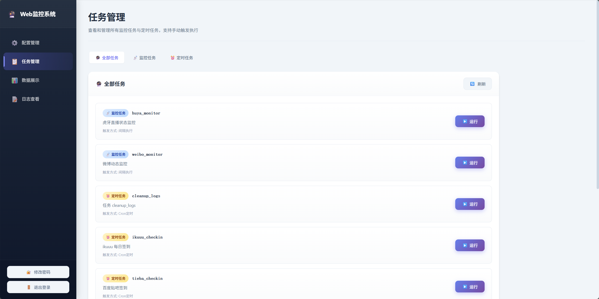
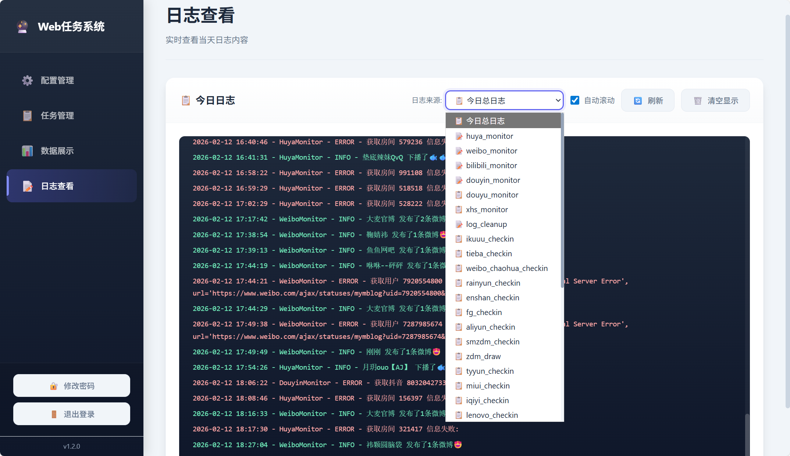

<div align="center">

#  WebMoniter

**多平台监控签到 · 开播提醒 · 多渠道推送**

<sub>监控 · 签到 · 开播提醒 · 推送 · 定时任务 · 配置热重载</sub>

<br/>

[](https://www.python.org/)
[](./LICENSE)
[](https://www.docker.com/)
[](https://apscheduler.readthedocs.io/)

[](https://github.com/666fy666/WebMoniter)
[](https://github.com/666fy666/WebMoniter)
[](https://hub.docker.com/r/fengyu666/webmoniter)
[](https://hub.docker.com/r/fengyu666/webmoniter)
[](https://github.com/666fy666/WebMoniter/releases/latest)

---

**Web任务系统**：一个支持 **虎牙直播、微博(超话)、哔哩哔哩、抖音、斗鱼、小红书、ikuuu、百度贴吧、雨云、恩山、天翼云盘、阿里云盘、什么值得买（含每日抽奖）、富贵论坛、小米社区、爱奇艺、联想乐豆、丽宝乐园、品赞、达美乐、小茅预约、一点万象、星空代理、千图网、夸克网盘、科技玩家、帆软社区、999 会员中心、中国福彩活动、双色球开奖通知、Freenom 续期、天气推送** 等多平台的监控与任务/签到工具。  
使用 **APScheduler** 做任务调度，支持 **10+ 推送通道**（企业微信、飞书、钉钉、Telegram、Bark、邮件等），  
**配置热重载**，开箱即用。

---

[🚀 快速开始](#-快速开始) •
[🐳 Docker 部署](#-docker-部署推荐) •
[💻 Windows 部署](#-windows-部署) •
[🐉 青龙面板](#-青龙面板部署) •
[🌐 Web 管理](#-web-管理界面) •
[⚙️ 配置说明](#️-配置说明)

[](https://666fy666.github.io/WebMoniter/) ·
[📡 API](docs/API.md) ·
[🏗️ 项目架构](docs/ARCHITECTURE.md) ·
[🛠 二次开发](docs/SECONDARY_DEVELOPMENT.md)

**📖 [完整文档站（使用指南与二次开发）](https://666fy666.github.io/WebMoniter/)**

<sub>文档站由 MkDocs Material 构建；本地预览：先执行 `uv sync --extra docs` 安装文档依赖，再执行 `uv run mkdocs serve`</sub>

---

**代码仓库**：[GitHub](https://github.com/666fy666/WebMoniter) · [GitCode](https://gitcode.com/qq_35720175/WebMoniter)

</div>

<br/>

## 📋 目录

- [📊 支持的平台和推送通道](#-支持的平台和推送通道)
- [🚀 快速开始](#-快速开始)（Docker · Windows · 青龙 · Web 管理 · 本地安装 · 更新）
- [⚙️ 配置说明](#️-配置说明)
- [🔌 API 调用](#-api-调用)
- [❓ 常见问题](#-常见问题)
- [📄 参考与致谢](#-参考与致谢)
- [📄 许可证](#-许可证)
- [Contributors](#contributors)
- [Star History](#star-history)

<br/>

---

## 📊 支持的平台和推送通道

支持 **虎牙/微博/哔哩哔哩/抖音/斗鱼/小红书** 监控，**30+ 定时任务**（iKuuu、贴吧、雨云、阿里云盘、什么值得买等），**15+ 推送通道**（企业微信、钉钉、飞书、Telegram、Bark 等）。详情见 [文档站](https://666fy666.github.io/WebMoniter/)。

<details>
<summary><strong>📋 展开查看完整列表（监控 / 定时任务 / 推送通道）</strong></summary>

### 监控平台支持

| 平台类型 | type     | 动态检测 | 开播/下播检测 |
|:--------:|:--------:|:--------:|:-------------:|
| 虎牙     | huya    | ❌       | ✅            |
| 微博     | weibo   | ✅       | ❌            |
| 哔哩哔哩 | bilibili| ✅       | ✅            |
| 抖音     | douyin  | ❌       | ✅            |
| 斗鱼     | douyu   | ❌       | ✅            |
| 小红书   | xhs     | ✅       | ❌            |

> 各监控任务支持 `enable` 配置，设为 `false` 可暂停该监控，热重载生效；未配置时默认为 `true`。

### 定时任务支持

| 任务名称     | 配置节点 / 任务 ID  | 默认执行时间 | 启动时执行 | 说明                                                                                         |
|:------------:|:-------------------:|:------------:|:----------:|:---------------------------------------------------------------------------------------------|
| 日志清理     | `log_cleanup`       | 02:10        | ✅         | 按 `log_cleanup.time` 执行，保留天数由 `log_cleanup.retention_days` 控制                       |
| iKuuu 签到   | `checkin`           | 08:00        | ✅         | `enable: true` 且配置完整时，每日定时签到并在启动时执行一次；从 ikuuu.club 提取）；支持多账号 `accounts` |
| 雨云签到     | `rainyun`           | 08:30        | ✅         | `enable: true` 且配置 API Key 时执行；支持多 API Key；自动完成腾讯验证码                     |
| 百度贴吧签到 | `tieba`             | 08:10        | ✅         | `enable: true` 且配置 Cookie（须含 BDUSS）时执行；支持多 Cookie                              |
| 微博超话签到 | `weibo_chaohua`     | 23:45        | ✅         | `enable: true` 且配置 Cookie（须含 XSRF-TOKEN）时执行；支持多 Cookie                         |
| 恩山论坛签到 | `enshan`            | 02:00        | ✅         | Cookie 查询积分/恩山币；支持多 Cookie                                                         |
| 天翼云盘签到 | `tyyun`             | 04:30        | ✅         | 手机号+密码登录（需 rsa 库），签到并抽奖；支持多账号 `accounts`                                |
| 阿里云盘签到 | `aliyun`            | 05:30        | ✅         | refresh_token 签到；支持多 `refresh_tokens`                                                    |
| 什么值得买签到 | `smzdm`           | 00:30        | ✅         | Cookie 签到；支持多 Cookie                                                                     |
| 值得买每日抽奖 | `zdm_draw`        | 07:30        | ✅         | Cookie 抽奖（可与 smzdm 共用）；支持多 Cookie                                                 |
| 富贵论坛签到 | `fg`                | 00:01        | ✅         | Cookie 签到；支持多 Cookie                                                                     |
| 小米社区签到 | `miui`              | 08:30        | ✅         | 手机号+密码登录（需 pycryptodome），签到+拔萝卜；支持多账号；存在封号风险                      |
| 爱奇艺签到   | `iqiyi`             | 06:00        | ✅         | Cookie 签到（须含 P00001、P00003、QC005、__dfp 等），签到+任务+抽奖+摇一摇；支持多 Cookie     |
| 联想乐豆签到 | `lenovo`            | 05:30        | ✅         | access_token 签到（RSA 签名）；支持多 `access_tokens`                                          |
| 丽宝乐园签到 | `lbly`              | 05:30        | ✅         | 请求体 JSON 调用 CheckinV2；支持多 `request_bodies`                                             |
| 品赞签到     | `pinzan`            | 08:00        | ✅         | 账号+密码登录，领取 IP；支持多账号 `accounts`                                                  |
| 达美乐签到   | `dml`               | 06:00        | ✅         | openid 完成分享+游戏任务；支持多 `openids`                                                     |
| 小茅预约     | `xiaomao`           | 09:00        | ✅         | i茅台预约申购 + 小茅运领奖励；配置格式：省份,城市,经度,纬度,设备id,token,MT-Token-Wap；需 pycryptodome |
| 一点万象签到 | `ydwx`              | 06:00        | ✅         | deviceParams + token 签到；支持多账号 `accounts`（参考 only_for_happly/ydwx.py）                      |
| 星空代理签到 | `xingkong`          | 07:30        | ✅         | 用户名+密码登录领积分；支持多账号 `accounts`（参考 only_for_happly/xingkong.py）                      |
| 千图网签到   | `qtw`               | 01:30        | ✅         | Cookie 签到；支持多 Cookie（参考 only_for_happly/qtw.py）                                            |
| Freenom 续期 | `freenom`           | 07:33        | ✅         | 使用邮箱+密码登录 Freenom，自动为 14 天内到期的免费域名续期 12 个月；支持多账号 `accounts`               |
| 天气推送     | `weather`           | 07:30        | ✅         | 根据 `city_code` 推送今日天气和未来 7 日预报（仅通知，不写入数据库）                                  |
| 夸克网盘签到 | `kuake`             | 02:00        | ✅         | 使用 Cookie 为多个夸克账号执行每日签到，领取空间；支持多 Cookie `cookies`                             |
| 科技玩家签到 | `kjwj`              | 07:30        | ✅         | 使用账号+密码登录科技玩家网站并执行签到；支持多账号 `accounts`                                       |
| 帆软签到     | `fr`                | 06:30        | ✅         | 帆软社区签到 + 摇摇乐，一次任务推送签到结果及活动信息                                               |
| 999 健康任务 | `nine_nine_nine`    | 15:15        | ✅         | 999 会员中心健康打卡 + 阅读 + 体检等任务；多 Authorization `tokens`                                 |
| 福彩抽奖     | `zgfc`              | 08:00        | ✅         | 中国福彩“新年”活动许愿 + 抽奖 + 点赞 + 奖品查询；多 Authorization `tokens`                        |
| 双色球通知   | `ssq_500w`          | 21:30        | ✅         | 获取最新双色球开奖信息 + 守号检测 + 冷号机选（仅娱乐通知，不涉及真实购彩）                            |
| Demo 示例    | `plugins.demo_task` | 08:30        | ✅         | 二次开发示例，不需要可在 `job_registry.TASK_MODULES` 中移除                                  |

> 恩山、天翼云盘、阿里云盘、什么值得买、值得买抽奖、富贵论坛、小米社区、爱奇艺、联想乐豆、丽宝乐园、品赞、达美乐、小茅预约、一点万象、星空代理、千图网 等签到/预约逻辑参考自 [only_for_happly](https://github.com/wd210010/only_for_happly)，已接入本项目统一推送与账号配置。**但主包并没有对其进行更新，所以碰到之前用不了的，现在也用不了！**

> **说明**：
> - 所有定时任务在**项目启动时都会立即执行一次**；各签到类任务内部会根据 `enable` 与配置完整性决定是否真正执行。
> - **当天已运行则跳过**：定时任务默认会检查当天是否已经运行过，如果已运行则跳过本次执行，日志输出 `{任务ID}: 当天已经运行过了，跳过该任务`。这避免了程序重启或定时触发时重复执行。
> - **手动触发执行**：通过 Web 管理界面的「任务管理」页面手动触发任务时，会绕过"当天已运行则跳过"检查，确保任务被强制执行。

### 推送通道支持

| 通道类型           | type             | 推送附带图片 | 说明                                                                                                                                       |
|:------------------:|:----------------:|:------------:|:-------------------------------------------------------------------------------------------------------------------------------------------|
| 企业微信群聊机器人 | wecom_bot        | ✅           | 🥳 推荐，新建群聊添加自定义机器人即可 👉 [文档](https://developer.work.weixin.qq.com/document/path/99110)                                   |
| 钉钉群聊机器人     | dingtalk_bot     | ✅           | 🥳 推荐，新建群聊添加自定义机器人，自定义关键词使用"【" 👉 [文档](https://open.dingtalk.com/document/robots/custom-robot-access)            |
| 飞书群聊机器人     | feishu_bot       | ❌ (暂不支持) | 🤩 推荐，新建群聊添加自定义机器人，自定义关键词使用"【" 👉 [文档](https://open.feishu.cn/document/client-docs/bot-v3/add-custom-bot)         |
| WxPusher           | wxpusher         | ✅           | 🥳 推荐，微信消息实时推送服务，可通过API实时给个人微信推送消息；配置 `app.base_url` 后可直接展示微博用户封面图 👉 [官网](https://wxpusher.zjiecode.com/) |
| NapCatQQ           | napcat_qq        | ✅           | 🐧 好用，但需要自行部署 NapCatQQ 👉 [项目地址](https://github.com/NapNeko/NapCatQQ)                                                         |
| Telegram机器人     | telegram_bot     | ✅           | 🪜 需要自备网络环境；在微博监控下会优先上传本地封面图作为推送图片 👉 [文档](https://core.telegram.org/bots)                                  |
| Bark               | bark             | ❌           | 🍎 适合苹果系用户，十分轻量，但没法推送图片 👉 [App Store](https://apps.apple.com/cn/app/id1403753865)                                      |
| 飞书自建应用       | feishu_apps      | ✅           | 🤔 可以使用个人版，创建应用并授予机器人权限 👉 [官网](https://open.feishu.cn/app?lang=zh-CN)                                                |
| Server酱_3         | serverChan_3     | ✅           | 🤔 需要安装app 👉 [官网](https://sc3.ft07.com/)                                                                                             |
| PushPlus           | pushplus         | ✅           | 📱 支持多种推送渠道（微信、邮件、Webhook等）；配置 `app.base_url` 后可直接展示微博用户封面图 👉 [官网](https://www.pushplus.plus/)          |
| Webhook            | webhook          | ✅ (POST)    | ⚡️ 通用的方式，请求格式详见 [附录](#webhook-支持的请求格式)                                                                                 |
| Gotify             | gotify           | ❌           | 🖥️ 适合自建服务器 👉 [官网](https://gotify.net)                                                                                             |
| 电子邮件           | email            | ✅           | 📧 通用的方式                                                                                                                               |
| 企业微信自建应用   | wecom_apps       | ✅           | 😢 新用户不再推荐，2022年6月20日之后新创建的应用需配置可信IP 👉 [官网](https://work.weixin.qq.com/wework_admin/frame#apps/createApiApp)      |
| QQ频道机器人       | qq_bot           | ✅           | 😢 需要自行创建机器人，并启用机器人在频道内发言的权限 👉 [官网](https://q.qq.com/#/app/create-bot)                                          |
| Server酱_Turbo     | serverChan_turbo | ✅           | 🙅‍♀️ 不推荐，不用安装app，但免费用户5次/天 👉 [官网](https://sct.ftqq.com)                                                                   |

</details>

<br/>

---

## 🚀 快速开始

### 🐳 Docker 部署（推荐）

> **要求**：Docker >= 20.10、Docker Compose >= 2.0，支持 amd64 / arm64。

```bash
# 1. 克隆项目
git clone https://github.com/666fy666/WebMoniter.git
cd WebMoniter

# 2. 复制并编辑配置文件
cp config.yml.sample config.yml
# 编辑 config.yml，配置监控任务和推送通道

# 3. 启动服务
docker compose up -d
```

访问 `http://localhost:8866`，默认账号 `admin` / `123`。

> 💡 **提示**：
> - `config.yml` 支持热重载（约 5 秒生效），无需重启
> - 数据持久化：`config.yml`、`data/`、`logs/` 已挂载，`docker compose down` 不会丢失

<br/>

---

<span id="-windows-部署"></span>
<details>
<summary><strong>💻 Windows 部署</strong></summary>

> **无需安装 Python 环境**，下载即用。

1. 前往 [GitHub Releases](https://github.com/666fy666/WebMoniter/releases/latest) 下载最新的 `WebMoniter-vX.X.X-windows-x64.zip`
2. 解压到任意目录
3. 将 `config.yml.sample` 复制为 `config.yml`，并按需编辑配置
4. 双击 `WebMoniter.exe` 启动（会弹出控制台窗口显示日志）

访问 `http://localhost:8866`，默认账号 `admin` / `123`。

> 💡 **提示**：
> - 首次运行 Windows 防火墙可能提示网络访问权限，请允许
> - 关闭控制台窗口即可停止程序
> - `config.yml` 支持热重载，修改配置无需重启

</details>

<br/>

---

<span id="-青龙面板部署"></span>
<details>
<summary><strong>🐉 青龙面板部署</strong></summary>

> **适用**：已安装 [青龙面板](https://github.com/whyour/qinglong) 的用户，通过环境变量配置，推送走青龙内置通知（QLAPI）。

**快速步骤**：

1. **添加环境变量**（青龙 → 环境变量）：如 `WEBMONITER_CHECKIN_ENABLE=true`、`WEBMONITER_CHECKIN_EMAIL`、`WEBMONITER_CHECKIN_PASSWORD`
2. **拉取脚本**：订阅 `https://github.com/666fy666/WebMoniter`，白名单 `ql/*.py`；或 `ql raw` 拉取单个脚本
3. **添加定时任务**：命令 `task WebMoniter/ql/ikuuu_checkin.py`，定时规则 `0 8 * * *`（示例）

> 💡 **推送通知**：青龙环境下自动使用**青龙系统通知**，在青龙「系统设置 → 通知设置」中配置推送方式即可，无需额外配置。

📖 **完整操作指南**（环境变量一览、多账号配置、常见问题）见 **[青龙面板兼容指南](docs/QINGLONG.md)**。

</details>

<br/>

---

### 🌐 Web 管理界面

配置管理、任务管理、数据展示、日志查看。默认账号 `admin` / `123`（生产环境请修改）。

<details>
<summary><strong>📷 展开查看界面截图</strong></summary>

<table>
<tr>
<td width="70%"><strong>配置管理</strong>：可视化编辑配置<br/></td>
<td width="30%"><strong>密码修改</strong><br/><br/><small>⚠️ 默认账号仅用于测试</small></td>
</tr>
</table>

**任务管理**：查看所有监控任务与定时任务，支持手动触发<br/>


**数据展示**：微博、虎牙等平台监控数据<br/>


**日志查看**：实时查看当天总日志或各任务专属日志，支持下拉切换日志来源<br/>


</details>

<br/>

---

### 📦 本地安装

> **要求**：Python >= 3.10、[uv](https://docs.astral.sh/uv/getting-started/installation/)

```bash
# 1. 克隆项目
git clone https://github.com/666fy666/WebMoniter.git
cd WebMoniter

# 2. 安装依赖
uv sync --locked

# 3. 复制配置文件
cp config.yml.sample config.yml

# 4. 启动程序
uv run python main.py

# 后台启动（推荐用于长期运行，终端关闭进程不受影响）
uv run python main.py &

# 可选：将日志输出重定向到文件
# uv run python main.py > webmoniter.log 2>&1 &
```

<br/>

---

### 🆙 更新

| 部署方式 | 命令                                                        |
|:--------:|:------------------------------------------------------------|
| Docker   | `docker compose pull && docker compose up -d`               |
| Windows  | 下载最新 Release 的 ZIP，解压覆盖（保留 `config.yml`）       |
| 本地     | `git pull` → `uv sync --locked` → 重启应用                  |

> 💡 配置支持热重载，多数更新无需重启。更新前建议备份 `config.yml`、`data/`。

**版本更新提醒**：系统会自动检测是否有新版本发布。登录 Web 管理界面后：
- 侧边栏底部显示**当前版本号**
- 若检测到新版本，页面顶部会显示**更新提示横幅**，点击可跳转至 [GitHub Releases](https://github.com/666fy666/WebMoniter/releases) 查看更新内容

<br/>

---

## ⚙️ 配置说明

| 配置类型       | 说明                                                                                                                                                                                   |
|:--------------:|:---------------------------------------------------------------------------------------------------------------------------------------------------------------------------------------|
| **应用配置**   | 所有配置项（微博/虎牙监控、iKuuu/雨云/贴吧/微博超话签到、调度器、免打扰、推送通道等）的说明与示例均在 **[`config.yml.sample`](config.yml.sample)** 中，以注释形式写在对应字段旁。复制为 `config.yml` 后按需修改即可；修改后**无需重启**，系统支持配置热重载（约 5 秒内生效）。 |
| **Docker 编排** | Docker 部署时的编排与运行参数（镜像、端口、卷挂载、资源限制、健康检查等）见 **[`docker-compose.yml`](docker-compose.yml)**；可按需修改端口、时区、内存限制等，修改后执行 `docker compose up -d` 使变更生效。                                |

**相关链接**：[支持的平台和推送通道](#-支持的平台和推送通道) · [文档站](https://666fy666.github.io/WebMoniter/)

<br/>

---

## 🔌 API 调用

系统提供 RESTful API，便于与其他系统集成或自动化操作，接口基于 FastAPI 实现。

📖 **详细说明**（认证、配置、数据查询、监控状态、日志及 Python/cURL 示例）请参阅 **[API 调用指南](docs/API.md)**。

<br/>

---

## ❓ 常见问题

<details>
<summary><strong>Q: 如何更新 Cookie？</strong></summary>

直接修改 `config.yml` 中的 Cookie 值，**无需重启容器或程序**。系统支持配置热重载，会在 5 秒内自动检测并应用新的配置。

</details>

<details>
<summary><strong>Q: 监控任务没有执行怎么办？</strong></summary>

1. 检查日志文件 `logs/main_*.log` 或使用 `docker compose logs`
2. 确认配置文件格式正确（YAML 语法）
3. 检查网络连接是否正常
4. 验证 Cookie 是否有效
5. 确认监控任务已启用（`enable: true`）

</details>

<details>
<summary><strong>Q: 如何调整监控频率？</strong></summary>

在 `config.yml` 中：

- 微博监控：修改 `weibo.monitor_interval_seconds`（秒）  
- 虎牙监控：修改 `huya.monitor_interval_seconds`（秒）  
- 哔哩哔哩监控：修改 `bilibili.monitor_interval_seconds`（秒）  
- 抖音监控：修改 `douyin.monitor_interval_seconds`（秒）  
- 斗鱼监控：修改 `douyu.monitor_interval_seconds`（秒）  
- 小红书监控：修改 `xhs.monitor_interval_seconds`（秒）  

**无需重启服务**，系统支持热重载，会在 5 秒内自动检测并更新任务间隔时间。

</details>

<details>
<summary><strong>Q: 数据库和日志文件在哪里？</strong></summary>

| 部署方式     | 数据库位置     | 日志位置       |
|:------------:|:--------------:|:--------------:|
| Docker 部署  | `./data/` 目录 | `./logs/` 目录 |
| 本地部署     | `./data/` 目录 | `./logs/` 目录 |

</details>

<details>
<summary><strong>Q: Web 界面无法访问怎么办？</strong></summary>

1. 确认系统已正常启动（检查日志）
2. 确认端口 8866 未被占用
3. Docker 部署时确认端口映射正确（`8866:8866`）
4. 检查防火墙设置，确保 8866 端口开放

</details>

<details>
<summary><strong>Q: 免打扰时段内会遗漏消息吗？</strong></summary>

免打扰时段内，监控任务会**正常执行**并更新数据库，但**不会推送通知**。如果您担心遗漏重要消息，可以查看日志文件或数据库了解监控记录，或关闭免打扰时段功能。

</details>

<br/>

---

## 📄 参考与致谢

本项目参考了以下优秀项目，特此表示感谢：

- [aio-dynamic-push](https://github.com/nfe-w/aio-dynamic-push)（[@nfe-w](https://github.com/nfe-w)）
- [only_for_happly](https://github.com/wd210010/only_for_happly)（[@wd210010](https://github.com/wd210010)）
- [RainyunCheckIn](https://github.com/FalseHappiness/RainyunCheckIn)（[@FalseHappiness](https://github.com/FalseHappiness)）

---

## 📄 许可证

本项目采用 [MIT License](./LICENSE) 许可，允许用于学习、研究和非商业用途。有关详细条款，请查阅 LICENSE 文件。

---

## Contributors

<a href="https://github.com/666fy666/WebMoniter/graphs/contributors">
  
</a>

---

## Star History

[](https://star-history.com/#666fy666/WebMoniter&Date)

---

<div align="center">

**如果这个项目对你有帮助，请给个 ⭐ Star！**

Made with ❤️ by [FY](https://github.com/666fy666)

</div>
