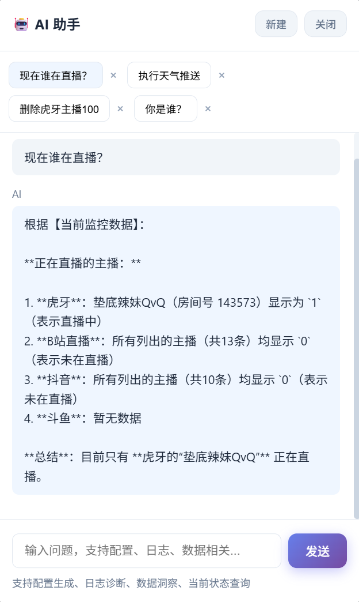
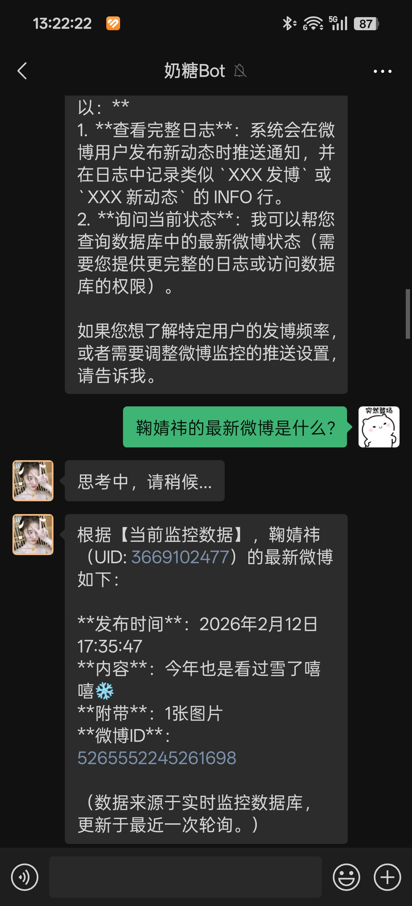

<div align="center">

#  WebMoniter

**多平台监控签到 · 开播提醒 · 多渠道推送**

<sub>监控 · 签到 · 开播提醒 · 推送 · 定时任务 · 配置热重载</sub>

<br/>

[](https://www.python.org/)
[](./LICENSE)
[](https://fastapi.tiangolo.com/)
[](https://www.docker.com/)
[](https://apscheduler.readthedocs.io/)
[](https://github.com/astral-sh/uv)
[](https://666fy666.github.io/WebMoniter/)

[](https://github.com/666fy666/WebMoniter)
[](https://github.com/666fy666/WebMoniter)
[](https://github.com/666fy666/WebMoniter/commits/main)
[](https://hub.docker.com/r/fengyu666/webmoniter)
[](https://hub.docker.com/r/fengyu666/webmoniter)
[](https://github.com/666fy666/WebMoniter/releases/latest)

---

**Web 任务系统**：多平台监控（虎牙/微博/B站/抖音/斗鱼/小红书）+ 30+ 定时签到（iKuuu、贴吧、雨云、阿里云盘等）+ 15+ 推送通道（企业微信、钉钉、飞书、Telegram 等）。配置热重载，AI 助手（RAG+LLM）支持问答、配置生成、日志诊断，可在 Web/企业微信/Telegram 对话。

---

[🚀 快速开始](#-快速开始) · [🐳 Docker](#-docker-部署推荐) · [💻 Windows](#-windows-部署) · [🐉 青龙](#-青龙面板部署) · [🌐 Web 管理](#-web-管理界面) · [🤖 AI 助手](docs/guides/ai-assistant.md) · [⚙️ 配置](#️-配置说明)

[📚 文档站](https://666fy666.github.io/WebMoniter/) · [📡 API](docs/API.md) · [🏗️ 架构](docs/ARCHITECTURE.md) · [🛠 二次开发](docs/SECONDARY_DEVELOPMENT.md)

---

**代码仓库**：[GitHub](https://github.com/666fy666/WebMoniter) · [GitCode](https://gitcode.com/qq_35720175/WebMoniter)

</div>

<br/>

## 📋 目录

[支持的平台](#-支持的平台和推送通道) · [快速开始](#-快速开始) · [AI 助手](#-ai-助手) · [配置](#️-配置说明) · [API](#-api-调用) · [常见问题](#-常见问题) · [参考与致谢](#-参考与致谢) · [许可证](#-许可证) · [Contributors](#contributors) · [Star History](#star-history)

<br/>

---

## 📊 支持的平台和推送通道

**监控**：虎牙 / 微博 / 哔哩哔哩 / 抖音 / 斗鱼 / 小红书（支持 `enable` 开关，热重载生效）。  
**定时任务**：30+（iKuuu、贴吧、雨云、阿里云盘、什么值得买、Freenom、天气推送等），启动时执行一次、按 `time` 每日定点、当天已运行则跳过（Web 手动触发可强制执行）。  
**推送**：15+ 通道（企业微信/钉钉/飞书/Telegram/Bark/邮件等）；`app.push_compress_with_llm` 可超限时 LLM 压缩，`app.push_personalize_with_llm` 可个性化标题与内容。

<details>
<summary><strong>📋 展开：监控类型表 / 定时任务列表 / 推送通道表</strong></summary>

### 监控

| 平台   | type     | 动态 | 开播/下播 |
|:------:|:--------:|:----:|:--------:|
| 虎牙   | huya     | ❌   | ✅       |
| 微博   | weibo    | ✅   | ❌       |
| 哔哩哔哩 | bilibili | ✅   | ✅       |
| 抖音   | douyin   | ❌   | ✅       |
| 斗鱼   | douyu    | ❌   | ✅       |
| 小红书 | xhs      | ✅   | ❌       |

### 定时任务（节选）

| 任务       | 配置节点   | 时间  |
|:----------:|:----------:|:-----:|
| 日志清理   | log_cleanup | 02:10 |
| iKuuu 签到 | checkin     | 08:00 |
| 雨云签到   | rainyun     | 08:30 |
| 贴吧签到   | tieba       | 08:10 |
| 微博超话   | weibo_chaohua | 23:45 |
| 阿里云盘   | aliyun      | 05:30 |
| 天气推送   | weather     | 07:30 |
| …          | …           | …     |

部分签到逻辑参考 [only_for_happly](https://github.com/wd210010/only_for_happly)，主包未单独维护，接口变更可能导致失效。雨云依赖 OpenCV；cv2 异常可试 `uv pip install --force-reinstall opencv-python-headless`。

### 推送通道（节选）

| 通道         | type          | 图 |
|:------------:|:-------------:|:--:|
| 企业微信群机器人 | wecom_bot    | ✅ |
| 钉钉机器人   | dingtalk_bot  | ✅ |
| 飞书机器人   | feishu_bot    | ❌ |
| Telegram     | telegram_bot  | ✅ |
| WxPusher     | wxpusher      | ✅ |
| Bark         | bark          | ❌ |
| PushPlus     | pushplus      | ✅ |
| …            | …             | …  |

</details>

---

## 🚀 快速开始

### 🐳 Docker 部署（推荐）

> **要求**：Docker >= 20.10、Docker Compose >= 2.0，支持 amd64 / arm64。

```bash
# 1. 克隆项目
git clone https://github.com/666fy666/WebMoniter.git
cd WebMoniter

# 2. 复制并编辑配置文件
cp config.yml.sample config.yml
# 编辑 config.yml，配置监控任务和推送通道

# 3. 启动服务
docker compose up -d
```

访问 `http://localhost:8866`，默认账号 `admin` / `123`。配置热重载约 5 秒生效；`data/`、`logs/` 已挂载可持久化；入口脚本会为目录赋权；改端口可在 `environment` 加 `PORT=8080` 并改 `ports`。

---

<span id="-windows-部署"></span>
<details>
<summary><strong>💻 Windows 部署</strong></summary>

1. [Releases](https://github.com/666fy666/WebMoniter/releases/latest) 下载 `WebMoniter-vX.X.X-windows-x64.zip`，解压
2. 复制 `config.yml.sample` 为 `config.yml` 并编辑
3. 双击 `WebMoniter.exe` 启动。访问 `http://localhost:8866`，默认 `admin` / `123`

无需 Python；防火墙提示请放行；关控制台即停；配置热重载生效。

</details>

<br/>

---

<span id="-青龙面板部署"></span>
<details>
<summary><strong>🐉 青龙面板部署</strong></summary>

[青龙面板](https://github.com/whyour/qinglong) 用户：环境变量配置（如 `WEBMONITER_CHECKIN_ENABLE`、`WEBMONITER_CHECKIN_EMAIL`），订阅本仓库白名单 `ql/*.py`，定时任务命令 `task WebMoniter/ql/ikuuu_checkin.py`（例：`0 8 * * *`）。推送走青龙系统通知，在「系统设置 → 通知设置」配置。详见 [青龙兼容指南](docs/QINGLONG.md)。

</details>

---

### 🌐 Web 管理界面

配置管理、任务管理、数据展示、日志查看；启用 `ai_assistant` 后可使用 AI 助手。默认 `admin` / `123`，生产环境请修改。

<details>
<summary><strong>📷 界面截图</strong></summary>

<table>
<tr>
<td width="70%"><strong>配置管理</strong><br/></td>
<td width="30%"><strong>密码修改</strong><br/></td>
</tr>
</table>
<br/>
<br/>


</details>

<br/>

---

<span id="-ai-助手"></span>
### 🤖 AI 助手

RAG + LLM：配置生成、日志诊断、数据洞察、可执行操作（如关监控、删列表项，确认后热重载）。入口：Web 底部「问 AI」、企业微信回调、Telegram Webhook。Web 支持流式（SSE）。

**启用**：`uv sync` → `config.yml` 配置 `ai_assistant`（`enable: true`，`provider`、`api_key`、`model`）。支持 OpenAI、DeepSeek、通义千问、智谱、Moonshot、Ollama 等。详见 [AI 助手指南](docs/guides/ai-assistant.md)。

<details>
<summary><strong>📷 AI 助手截图</strong></summary>

<table>
<tr>
<td></td>
<td></td>
<td></td>
<td></td>
</tr>
</table>
<table>
<tr>
<td></td>
<td></td>
<td></td>
<td></td>
</tr>
</table>

</details>

---

### 📦 本地安装

> **要求**：Python >= 3.10、[uv](https://docs.astral.sh/uv/getting-started/installation/)

```bash
# 1. 克隆项目
git clone https://github.com/666fy666/WebMoniter.git
cd WebMoniter

# 2. 安装依赖
uv sync --locked

# 3. 复制配置文件
cp config.yml.sample config.yml

# 4. 启动（默认 8866，PORT=8080 uv run python main.py 可改端口）
uv run python main.py
# 后台：uv run python main.py &
```

### 🆙 更新

| 部署方式 | 命令                                                        |
|:--------:|:------------------------------------------------------------|
| Docker   | `docker compose pull && docker compose up -d`               |
| Windows  | 下载最新 Release 的 ZIP，解压覆盖（保留 `config.yml`）       |
| 本地     | `git pull` → `uv sync --locked` → 重启应用                  |

配置热重载，多数更新无需重启；建议备份 `config.yml`、`data/`。Web 侧边栏显示版本号，有新版本时顶部有更新横幅，可跳转 [Releases](https://github.com/666fy666/WebMoniter/releases)。

---

## ⚙️ 配置说明

- **应用**：[`config.yml.sample`](config.yml.sample) 含全部配置注释，复制为 `config.yml` 修改即可，热重载约 5 秒生效。
- **Docker**：[`docker-compose.yml`](docker-compose.yml)、[`docker-entrypoint.sh`](docker-entrypoint.sh) 负责编排与 data/logs 赋权。详见 [文档站](https://666fy666.github.io/WebMoniter/)。

---

## 🔌 API 调用

RESTful API（FastAPI），认证、配置、数据、监控状态、日志等。详见 [API 指南](docs/API.md)。

---

## ❓ 常见问题

<details>
<summary><strong>Q: 如何更新 Cookie？</strong></summary>
改 `config.yml` 中 Cookie 即可，热重载约 5 秒生效，无需重启。
</details>

<details>
<summary><strong>Q: 监控没执行？</strong></summary>
查 `logs/main_*.log` 或 `docker compose logs`；确认 YAML 格式、网络、Cookie、`enable: true`。
</details>

<details>
<summary><strong>Q: 如何改监控频率？</strong></summary>
改 `config.yml` 中对应 `*_monitor_interval_seconds`（如 `weibo`、`huya`、`bilibili`、`douyin`、`douyu`、`xhs`），热重载生效。
</details>

<details>
<summary><strong>Q: 数据库/日志在哪？</strong></summary>
`./data/`、`./logs/`（Docker/本地一致）。
</details>

<details>
<summary><strong>Q: Docker 下 RAG/Chroma 报错？</strong></summary>
入口脚本已为 data/logs 赋权。仍报错可：重拉镜像；删 `./data/ai_assistant_chroma` 重建；宿主机 `chmod -R 777 ./data ./logs`。
</details>

<details>
<summary><strong>Q: Web 打不开？</strong></summary>
确认已启动、端口 8866 未占用、Docker 映射 `8866:8866`、防火墙放行。
</details>

<details>
<summary><strong>Q: 免打扰会漏消息吗？</strong></summary>
任务照常执行并写库，仅不推送；可查日志或关免打扰。
</details>

---

## 📄 参考与致谢

| 项目 | 说明 |
|:-----|:-----|
| [aio-dynamic-push](https://github.com/nfe-w/aio-dynamic-push) | 推送与调度 |
| [only_for_happly](https://github.com/wd210010/only_for_happly) | 部分签到逻辑 |
| [RainyunCheckIn](https://github.com/FalseHappiness/RainyunCheckIn) / [Rainyun-Qiandao](https://github.com/Jielumoon/Rainyun-Qiandao) | 雨云签到与续费 |
| [all-in-rag](https://github.com/datawhalechina/all-in-rag) | AI 助手 RAG 架构 |

---

## 📄 许可证

[MIT License](./LICENSE)

---

## Contributors

<a href="https://github.com/666fy666/WebMoniter/graphs/contributors">
  
</a>

---

## Star History

[](https://star-history.com/#666fy666/WebMoniter&Date)

---

<div align="center">

**如果这个项目对你有帮助，请给个 ⭐ Star！**

Made with ❤️ by [FY](https://github.com/666fy666)

</div>
