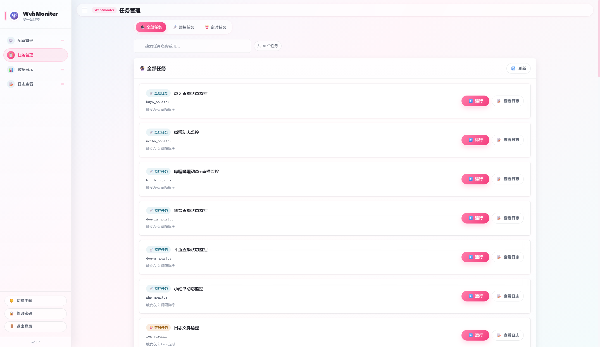
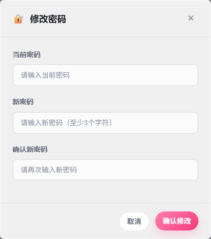
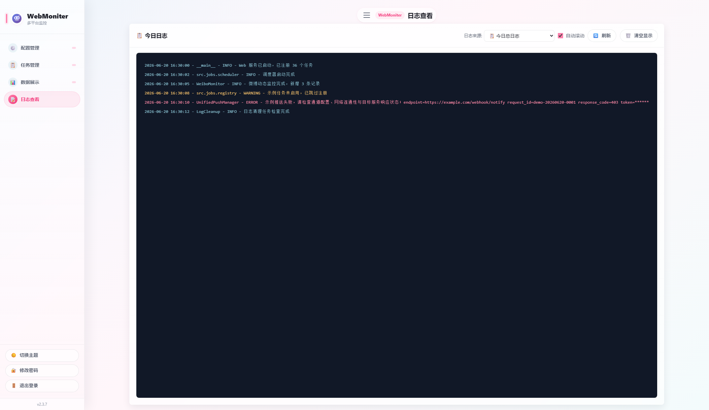

<div align="center">

#  WebMoniter

**多平台监控签到 · 开播提醒 · 多渠道推送**

<sub>监控 · 签到 · 开播提醒 · 推送 · 定时任务 · 配置热重载</sub>

[](https://www.python.org/)
[](LICENSE)
[](https://fastapi.tiangolo.com/)
[](https://hub.docker.com/r/fengyu666/webmoniter)
[](https://apscheduler.readthedocs.io/)
[](https://docs.astral.sh/uv/)
[](https://666fy666.github.io/WebMoniter/)
[](https://github.com/666fy666/WebMoniter/stargazers)
[](https://github.com/666fy666/WebMoniter/forks)
[](https://github.com/666fy666/WebMoniter/commits/main)
[](https://hub.docker.com/r/fengyu666/webmoniter)
[](https://hub.docker.com/r/fengyu666/webmoniter/tags)
[](https://hub.docker.com/r/fengyu666/webmoniter/tags)
[](https://hub.docker.com/r/fengyu666/webmoniter/tags)
[](https://github.com/666fy666/WebMoniter/releases/latest)

[文档站](https://666fy666.github.io/WebMoniter/) ·
[安装](docs/installation.md) ·
[配置](docs/guides/config.md) ·
[API](docs/API.md) ·
[二次开发](docs/SECONDARY_DEVELOPMENT.md) ·
[Releases](https://github.com/666fy666/WebMoniter/releases/latest)

**代码仓库**：[GitHub](https://github.com/666fy666/WebMoniter) · [GitCode](https://gitcode.com/qq_35720175/WebMoniter)

</div>

---

## 简介

WebMoniter 是一个基于 Python、FastAPI 和 APScheduler 的任务系统，用于统一管理：

- 平台监控：虎牙、微博、哔哩哔哩、抖音、斗鱼、小红书。
- 定时任务：iKuuu、贴吧、微博超话、雨云、阿里云盘、什么值得买、Freenom、天气推送等 **29 个**签到/提醒任务（见 `src/jobs/registry.py`）。
- 多渠道推送：企业微信、钉钉、飞书、Telegram、Bark、WxPusher、邮件等 **18 种** type。
- Web 管理：配置编辑、任务管理、数据展示、日志查看、密码管理。

配置支持热重载，修改 `config.yml` 后通常约 5 秒内生效。

---

## 界面预览

| 配置管理 | 任务管理 |
|:--:|:--:|
|  |  |

更多截图与功能说明见 [文档首页](docs/index.md) 和 [Web 管理界面](docs/guides/web-ui.md)。

<details>
<summary><strong>展开更多项目展示</strong></summary>

### 支持平台

| 平台 | type | 动态 | 开播/下播 |
|:--:|:--:|:--:|:--:|
| 虎牙 | `huya` | 否 | 是 |
| 微博 | `weibo` | 是 | 否 |
| 哔哩哔哩 | `bilibili` | 是 | 是 |
| 抖音 | `douyin` | 否 | 是 |
| 斗鱼 | `douyu` | 否 | 是 |
| 小红书 | `xhs` | 是 | 否 |

### 定时任务节选

| 任务 | 配置节点 | 默认时间 |
|:--:|:--:|:--:|
| 日志清理 | `log_cleanup` | 02:10 |
| iKuuu 签到 | `checkin` | 08:00 |
| 雨云签到 | `rainyun` | 08:30 |
| 贴吧签到 | `tieba` | 08:10 |
| 微博超话 | `weibo_chaohua` | 23:45 |
| 阿里云盘 | `aliyun` | 05:30 |
| 天气推送 | `weather` | 07:30 |

### 推送通道节选

| 通道 | type | 图文 |
|:--:|:--:|:--:|
| 企业微信群机器人 | `wecom_bot` | 是 |
| 钉钉机器人 | `dingtalk_bot` | 是 |
| 飞书机器人 | `feishu_bot` | 否 |
| Telegram | `telegram_bot` | 是 |
| WxPusher | `wxpusher` | 是 |
| Bark | `bark` | 否 |
| PushPlus | `pushplus` | 是 |

### 更多界面截图

| 密码修改 | 数据展示 | 日志查看 |
|:--:|:--:|:--:|
|  |  |  |

</details>

---

## 快速开始

### Docker

精简镜像 `latest` 适合大多数监控和 HTTP 签到任务；完整镜像 `full` 额外包含 Chromium/Chromedriver 与浏览器签到依赖，适用于 iKuuu、雨云等需要网页登录的任务。

**Compose 精简镜像启动（推荐）**

```bash
git clone https://github.com/666fy666/WebMoniter.git
cd WebMoniter
cp config/config.yml.sample config.yml

# 精简镜像：启动
docker compose -f docker/docker-compose.yml pull
docker compose -f docker/docker-compose.yml up -d

# 精简镜像：查看、停止、再次启动、重启、删除容器/网络
docker compose -f docker/docker-compose.yml logs -f
docker compose -f docker/docker-compose.yml stop
docker compose -f docker/docker-compose.yml start
docker compose -f docker/docker-compose.yml restart
docker compose -f docker/docker-compose.yml down
```

访问 `http://localhost:8866`，默认账号 `admin` / `123`。首次登录后请修改密码。

iKuuu、雨云等浏览器签到请使用完整镜像：

```bash
docker compose -f docker/docker-compose.full.yml pull
docker compose -f docker/docker-compose.full.yml up -d

docker compose -f docker/docker-compose.full.yml logs -f
docker compose -f docker/docker-compose.full.yml stop
docker compose -f docker/docker-compose.full.yml start
docker compose -f docker/docker-compose.full.yml restart
docker compose -f docker/docker-compose.full.yml down
```

<details>
<summary><strong>单容器 · 精简镜像</strong></summary>

```bash
docker pull fengyu666/webmoniter:latest
docker run -d --name webmoniter --restart unless-stopped \
  -p 8866:8866 --shm-size=128m \
  -e TZ=Asia/Shanghai \
  -v "$(pwd)/config.yml:/app/config.yml" \
  -v "$(pwd)/data:/app/data" \
  -v "$(pwd)/logs:/app/logs" \
  fengyu666/webmoniter:latest

docker stop webmoniter
docker start webmoniter
docker restart webmoniter
# 删除容器；容器运行中可改用 docker rm -f webmoniter
docker rm webmoniter
docker image rm fengyu666/webmoniter:latest
```

</details>

<details>
<summary><strong>单容器 · 完整镜像</strong></summary>

```bash
docker pull fengyu666/webmoniter:full
docker run -d --name webmoniter-full --restart unless-stopped \
  -p 8866:8866 --shm-size=256m \
  -e TZ=Asia/Shanghai \
  -e CHROME_BIN=/usr/bin/chromium \
  -e CHROMEDRIVER_PATH=/usr/bin/chromedriver \
  -v "$(pwd)/config.yml:/app/config.yml" \
  -v "$(pwd)/data:/app/data" \
  -v "$(pwd)/logs:/app/logs" \
  fengyu666/webmoniter:full

docker stop webmoniter-full
docker start webmoniter-full
docker restart webmoniter-full
# 删除容器；容器运行中可改用 docker rm -f webmoniter-full
docker rm webmoniter-full
docker image rm fengyu666/webmoniter:full
```

Windows PowerShell 如遇挂载路径问题，可把 `$(pwd)` 改成当前目录的绝对路径。更多端口、挂载、更新与数据保留说明见 [安装与运行](docs/installation.md) 和 [docker/README.md](docker/README.md)。

</details>

### 本地运行

```bash
git clone https://github.com/666fy666/WebMoniter.git
cd WebMoniter

uv python install 3.11
uv venv --python 3.11
uv sync --locked --extra dev --extra rainyun
cp config/config.yml.sample config.yml
uv run python main.py
```

源码启动会先执行环境预检：检查 uv、Python 3.11、虚拟环境、pytest/dev 依赖，以及启用 iKuuu/雨云时的 Chrome/本地 chromedriver 状态；未通过时不会启动 Web 服务，并会打印对应修复方案。若需要启动前实际拉起 WebDriver 做烟测，可设置 `WEBMONITER_PREFLIGHT_BROWSER_SMOKE=1`。

不使用浏览器签到时也可以只安装核心与开发依赖：

```bash
uv sync --locked --extra dev
```

停止服务：在终端按 `Ctrl+C`。程序会关闭 Web、配置监控和数据库连接；如同步任务阻塞，最多约 12 秒后强制退出，再按一次 `Ctrl+C` 会立即强制退出。

### Windows 一键包

从 [Releases](https://github.com/666fy666/WebMoniter/releases/latest) 下载 `WebMoniter-vX.X.X-windows-x64.zip`，解压后复制 `config.yml.sample` 为 `config.yml`，双击 `WebMoniter.exe` 启动。

### 青龙面板

青龙用户可通过环境变量配置，使用 `python -m src.ql <task_id>` 运行定时任务。详见 [青龙面板兼容指南](docs/QINGLONG.md)。

---

## 配置

核心配置文件为仓库根目录的 `config.yml`。首次使用请从模板复制：

```bash
cp config/config.yml.sample config.yml
```

配置项说明见：

- [配置说明](docs/guides/config.md)
- [监控与定时任务](docs/guides/tasks.md)
- [推送通道](docs/guides/push-channels.md)

---

## 功能入口

| 功能 | 文档 |
|---|---|
| 安装部署 | [docs/installation.md](docs/installation.md) |
| Web 管理界面 | [docs/guides/web-ui.md](docs/guides/web-ui.md) |
| 任务配置 | [docs/guides/tasks.md](docs/guides/tasks.md) |
| 监控任务 | [docs/guides/tasks/monitors.md](docs/guides/tasks/monitors.md) |
| 签到任务 | [docs/guides/tasks/checkin.md](docs/guides/tasks/checkin.md) |
| 推送通道 | [docs/guides/push-channels.md](docs/guides/push-channels.md) |
| REST API | [docs/API.md](docs/API.md) |
| 架构说明 | [docs/ARCHITECTURE.md](docs/ARCHITECTURE.md) |
| 二次开发 | [docs/SECONDARY_DEVELOPMENT.md](docs/SECONDARY_DEVELOPMENT.md) |
| 常见问题 | [docs/faq.md](docs/faq.md) |

---

<details>
<summary><strong>开发说明</strong></summary>

```bash
uv sync --extra dev --extra rainyun
uv run ruff check .
uv run black --check .
uv run pytest -q
```

新增监控或定时任务请参考 [二次开发指南](docs/SECONDARY_DEVELOPMENT.md)。`src/tests/` 中有 metadata、注册表与 enable 映射一致性测试，漏配时 `uv run pytest` 会失败。完整架构说明见 [docs/ARCHITECTURE.md](docs/ARCHITECTURE.md)。项目当前采用模块化结构：

| 模块 | 职责 |
|------|------|
| `main.py` | 应用入口：Web、调度器、配置热重载、优雅关闭 |
| `src/core/` | 运行时（`runtime.py` 12 秒退出 watchdog）、路径（`paths.py`）、版本、HTTP 工具 |
| `src/settings/` | 配置模型（`config.py`）、YAML 映射（`loader_specs.py`）、热重载（`watcher.py`）、DB 同步（`db_sync.py`） |
| `src/jobs/` | 任务元数据（`metadata.py`）、调度（`scheduler.py`）、注册（`registry.py`）、启用映射（`enable_fields.py`）、执行结果（`task_outcome.py`）、生命周期（`lifecycle.py`）、日志（`log_manager.py`）、运行记录（`tracker.py`） |
| `src/storage/` | SQLite（`database.py`）、Cookie 缓存（`cookie_cache.py`） |
| `src/monitors/` | 6 个平台监控（interval 触发，清单由 `metadata.MONITOR_SPECS` 生成） |
| `src/tasks/` | 29 个定时/签到任务（Cron 触发，含 `rainyun/` 子包，清单由 `metadata.TASK_SPECS` 生成） |
| `src/push_channel/` | 18 种推送 type（企业微信、钉钉、Telegram 等，含 `demo`、`qlapi`） |
| `src/web/` | FastAPI 应用（`app.py`）、路由（`routers/`）、认证/配置/数据辅助、`templating.py`、`static_files.py` |
| `src/webUI/` | 前端静态资源与 Jinja2 模板 |
| `src/ql/` | 青龙 CLI（`python -m src.ql <task_id>`，环境变量兼容见 `compat.py`） |
| `src/tests/` | pytest 单元与 smoke 测试 |

</details>

---

## 致谢

部分签到与推送思路参考了以下项目：

- [aio-dynamic-push](https://github.com/nfe-w/aio-dynamic-push)
- [only_for_happly](https://github.com/wd210010/only_for_happly)
- [RainyunCheckIn](https://github.com/FalseHappiness/RainyunCheckIn)
- [Rainyun-Qiandao](https://github.com/Jielumoon/Rainyun-Qiandao)

---

## Contributors

<a href="https://github.com/666fy666/WebMoniter/graphs/contributors">
  
</a>

---

## Star History

<a href="https://www.star-history.com/?type=date&repos=666fy666%2FWebMoniter">
 <picture>
   <source media="(prefers-color-scheme: dark)" srcset="https://api.star-history.com/chart?repos=666fy666/WebMoniter&type=date&theme=dark&legend=top-left&sealed_token=_5ZVFJzKqU7_wg-KVdKrKUkkMj35yaXuBxHrWm8162OiC9NNzbOAIQ9OG5radniZEsxW86qcYUpzuN3zAYsQWUZNOf_6VzxJGqjIUtAI-nSadvI5xEdSqgSTqkiN5N3Ui5oGw_BXQQ8mCT32TQXY1uzJLz_c3Pyq7we_jYGxNcscsxqhsAYBGcMAji0V" />
   <source media="(prefers-color-scheme: light)" srcset="https://api.star-history.com/chart?repos=666fy666/WebMoniter&type=date&legend=top-left&sealed_token=_5ZVFJzKqU7_wg-KVdKrKUkkMj35yaXuBxHrWm8162OiC9NNzbOAIQ9OG5radniZEsxW86qcYUpzuN3zAYsQWUZNOf_6VzxJGqjIUtAI-nSadvI5xEdSqgSTqkiN5N3Ui5oGw_BXQQ8mCT32TQXY1uzJLz_c3Pyq7we_jYGxNcscsxqhsAYBGcMAji0V" />
   
 </picture>
</a>

---

## 许可证

[MIT License](LICENSE)

<div align="center">

**如果这个项目对你有帮助，请给个 ⭐ Star！**

Made with ❤️ by [FY](https://github.com/666fy666)

</div>
