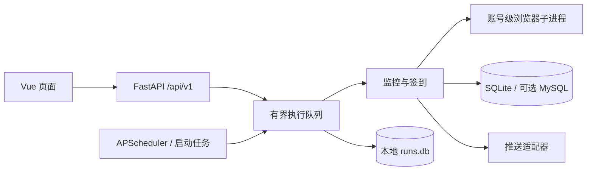

# 架构

WebMoniter 使用 Vue 3 + TypeScript + Vite、FastAPI、APScheduler 和 SQLite。生产由 Python 提供前端静态产物，不运行 Node 服务。仅启动一个 Web／调度进程，避免重复任务。

## 模块边界

| 层 | 路径 | 职责 |
|---|---|---|
| 页面与状态 | `frontend/src/views/`、`stores.ts` | 概览、任务、配置、数据、日志、账户、登录；主题和会话状态 |
| 公共 UI | `frontend/src/components/`、`style.css` | 配置字段、图标、材质与响应式设计 |
| API 客户端 | `frontend/src/api.ts`、`composables.ts` | 类型、CSRF、错误、请求超时、可见性轮询和失败退避 |
| Web | `src/web/app.py`、`routers/v1.py` | 生命周期、路由、SPA、认证依赖与健康检查 |
| 配置服务 | `src/web/config_service.py`、`src/settings/` | 元数据、凭据保留、版本冲突、原子写入与热重载 |
| 执行服务 | `src/jobs/execution.py` | 有界队列、去重、并发、持久化状态与中断处理 |
| 调度注册 | `src/jobs/metadata.py`、`registry.py`、`lifecycle.py` | 统一注册、启用状态、触发器、启动任务 |
| 平台业务 | `src/monitors/`、`src/tasks/`、`src/push_channel/` | 监控、签到、推送适配器，保留青龙入口 |
| 浏览器边界 | `src/core/browser_process.py`、`browser_worker.py` | 凭据通过 stdin IPC；账号级独立进程、超时终止与回收 |
| 存储 | `src/storage/` | SQLite WAL、MySQL 连接池、镜像与 outbox 一致性 |

## 执行与资源

普通任务并发 4，待执行队列容量 100，阻塞 I/O 线程池上限 4。同一任务 ID 只保留一个排队或执行实例，手动与定时冲突返回已有记录。每次浏览器尝试只允许一个账号，默认 180 秒超时。超时、取消和正常结束均清理进程组，避免 Chrome 后代残留。重试等待发生在浏览器名额释放之后。

雨云、iKuuu 和微博 Cookie 更新通过独立 Python 子进程运行浏览器代码；OCR 与 ONNX 按需导入，完成后释放进程内存。主进程负责配置写回、运行记录与通知。凭据不放入进程命令行。浏览器子进程错误以类型返回，stderr 不转发敏感输出。

执行记录在本地 `runs.db`，独立于可切换的业务数据库。关闭／重启将未完成记录标记 `interrupted`，不重放有副作用的任务。手动任务仍受启用状态控制，但可绕过每日成功跳过；只有完整成功更新每日完成状态，部分成功可继续重试。

## 数据与配置

默认业务数据库 `data/data.db` 使用共享 aiosqlite 连接与 WAL，退出统一关闭。MySQL 保留原来的权威写入、SQLite 镜像、outbox、回退和恢复顺序，接口分页不改变一致性。微博 `published_at` 在入库时解析并建立索引，避免列表读取全部正文排序。

outbox 按 ID 分批读取，连续同表 upsert 批量写入，全部批次仍在一个事务内提交；镜像跨表读取使用显式只读可重复读快照。读事务及时结束以复用连接，异常与取消在事务边界回滚；一致性前提和跨库限制见 [数据库配置](guides/config.md#mysql-sync)。

配置使用 `WEBMONITER_CONFIG_FILE`，默认 `config.yml`，Docker 为 `/app/config/config.yml`。写入在同一锁内比较版本、保留未修改密钥、校验并原子替换。配置监听刷新调度和数据库设置。元数据统一从配置模型、字段映射、样例和任务注册表生成，不在页面复制第二份平台列表。

监听器比较文件身份、大小与纳秒时间；回调失败不确认版本，在下一次轮询读取最新配置重试。目标删除失败向上传播，重复主键删除幂等；相同触发器和已恢复的任务不重复调度。该回调不主动执行签到或推送，配置应用也不是跨数据库和调度器的原子事务。

日志按日和大小轮转（单文件 10 MiB，2 个轮转副本），默认保留 3 天，每分钟检查约 100 MiB 总量预算，优先删除最旧非活动文件。活动文件不被删除，所以预算不是严格磁盘配额；Docker 控制台日志另限 10 MB × 3。

## 安全与界面

初始化管理员默认 `admin / 123`，支持可选环境变量覆盖；密码使用 Argon2id。会话签名文件、账户文件和会话列表持久化于数据目录，Cookie 与服务端会话有效期 7 天。请求统一鉴权、CSRF、来源检查、体积限制，配置默认遮蔽密钥，敏感响应不缓存。

前端按路由加载，Pinia 管理会话与外观；只把主题／效果偏好写入 localStorage。玻璃材质用于导航和工具栏，正文、表单和日志使用清晰底色。局部交互高光、可中断动画、移动底栏、44 px 触控区域、明暗和系统主题，支持自动／完整／简化效果及系统减少动态效果。无全屏持续渲染、无自定义光标。隐藏页面停止轮询和动画，日志有界保留，查询失败指数退避。

设计参考：[Apple Liquid Glass](https://developer.apple.com/videos/play/wwdc2025/219/)、[ColorOS 16](https://www.oppo.com/en/coloros16/) 的材质与连续动效；任务交互参考 [Uptime Kuma](https://github.com/louislam/uptime-kuma) 的状态优先呈现。这里是 CSS Web 近似实现，并非原生光学渲染。页面分包参考 [Vue 性能建议](https://vuejs.org/guide/best-practices/performance)。

## 验证

`src/tests/` 保留配置、执行、平台、推送、MySQL 回退、事务取消与安全回归；`frontend/tests/` 包含客户端单测和连接隔离后端的 Playwright 关键交互测试，第三方数据使用模拟响应。检查命令集中在 [开发指南](SECONDARY_DEVELOPMENT.md#development-checks)，视觉、实机和外部服务验收集中在 [自测清单](guides/web-ui.md#manual-checks)。`scripts/container_benchmark.py` 保留为按需资源测试工具；本轮结果与历史测量边界见 [审查报告](REFACTOR_AUDIT.md)。
