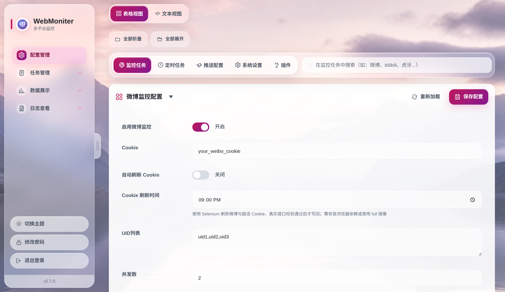

# 配置说明

所有运行配置均通过 **`config.yml`** 管理。修改后**无需重启**，系统支持配置热重载（约 5 秒内生效）。

---

## 配置管理界面预览

部署后可在 Web 管理界面的「配置管理」中**可视化编辑** `config.yml`：左侧为导航/表格视图，右侧可切换为 YAML 文本编辑，保存后约 5 秒内自动生效。

{ width="800" }

---

## 操作步骤（首次使用）

1. **复制配置文件**  
   在项目根目录执行：`cp config/config.yml.sample config.yml`（Windows 下复制并重命名为 `config.yml`）。

2. **按需编辑 `config.yml`**  
   - 先配置至少一个 **推送通道**（[推送通道配置详解](push-channels.md)），否则监控/签到结果无法收到通知。  
   - 再配置要使用的 **监控任务**（[监控任务详解](tasks/monitors.md)）或 **定时/签到任务**（[定时任务详解](tasks/checkin.md)）。  
   - 各配置块字段含义见本文「主要配置块」及上述详解页。

3. **保存并等待生效**  
   保存 `config.yml` 后约 5 秒内自动生效，无需重启程序或容器。

4. **可选：Web 界面编辑**  
   部署完成后访问 `http://localhost:8866`，可在「配置管理」中可视化编辑并保存，同样支持热重载。

---

## 配置文件来源

| 配置类型   | 说明 |
|:----------:|:-----|
| **应用配置** | 监控、签到、推送、免打扰等均在 **`config/config.yml.sample`** 中有注释说明。以该文件为模板在仓库根复制为 `config.yml` 后按需修改。 |
| **Docker 编排** | **`docker/docker-compose.yml`**（精简，对 **`docker/Dockerfile`**）；雨云用 **`docker/docker-compose.full.yml`**（对 **`docker/Dockerfile.full`** / 标签 `full`）。**`docker/docker-entrypoint.sh`** 为 `data/`、`logs/` 赋权。请在仓库根执行：`docker compose -f docker/docker-compose.yml up -d` 或 `-f docker/docker-compose.full.yml`。 |

---

## 主要配置块概览

| 类型       | 配置节点示例 | 说明 |
|:----------:|:-------------|:-----|
| 应用基础   | `app`        | 全局基础配置，目前包括 `base_url`（用于拼接微博封面图等资源的完整 URL） |
| 数据库     | `mysql`      | 可选 MySQL 主库；本地 SQLite 始终作为镜像与故障回退 |
| 微博监控与 Cookie 刷新 | `weibo` | `enable`、Cookie、UID、监控间隔及 `cookie_refresh_enable/time`，详见 [监控任务详解](tasks/monitors.md#weibo-monitor) 与 [定时任务详解](tasks/checkin.md) |
| 虎牙监控   | `huya`       | `enable`、房间号列表、监控间隔、推送通道等，详见 [监控任务详解](tasks/monitors.md#huya-monitor) |
| 哔哩哔哩   | `bilibili`   | `enable`、UID 列表、Cookie（可选）、动态+开播/下播检测，详见 [监控任务详解](tasks/monitors.md#bilibili-monitor) |
| 抖音直播   | `douyin`     | `enable`、抖音号列表、开播/下播检测，详见 [监控任务详解](tasks/monitors.md#douyin-monitor) |
| 斗鱼直播   | `douyu`      | `enable`、房间号列表、开播/下播检测，详见 [监控任务详解](tasks/monitors.md#douyu-monitor) |
| 小红书     | `xhs`        | `enable`、Profile ID 列表、Cookie（可选）、动态检测，详见 [监控任务详解](tasks/monitors.md#xhs-monitor) |
| 各签到任务 | `checkin`、`tieba`、`rainyun` 等 | 每类任务有独立节点，含 `enable`、账号/Cookie/Token、`time`、`push_channels`，详见 [定时任务详解](tasks/checkin.md) |
| 推送通道   | `push_channel` | 列表形式，每项需 `name`、`type` 及该类型所需参数，详见 [推送通道配置详解](push-channels.md) |
| 日志清理   | `log_cleanup` | 执行时间、日志保留天数 |
| 免打扰时段 | `quiet_hours` | 启用后，在指定时间段内不推送通知（任务照常执行） |
| 插件任务   | `plugins.demo_task` 等 | 二次开发扩展任务；不需要可删除配置，并在 `src/jobs/metadata.py` 的 `TASK_SPECS` 中移除对应 `TaskSpec` |

---

## 应用基础配置 `app`

`app` 节点包含全局基础配置：

```yaml
app:
  # 对外访问的基础地址，用于构造图片等资源的完整 URL（例如微博封面图）
  # 建议填写你实际访问 Web 管理界面的地址：
  # - 本机调试: "http://localhost:8866"
  # - 局域网/公网: "http://your-domain.com:8866"
  # 留空时，微博监控仍会推送，但无法为大部分通道拼接出可访问的封面图 URL，将退回使用内置示例图片。
  base_url: "http://localhost:8866"
```

设置 `base_url` 后，微博监控会：

- 将被监控用户的头像与手机封面图缓存到 `data/weibo/<用户名>/`；
- 通过 `base_url + /weibo_img/<用户名>/cover_image_phone.jpg` 为大部分推送通道提供可访问的封面图 URL；
- 对于支持本地图片上传的通道（如 `telegram_bot`），还会直接上传本地封面图。

## MySQL 主库与 SQLite 备份 `mysql`

默认只使用 `data/data.db`。填写并启用下面的配置后，MySQL 成为权威数据源，项目写入会同步到本地 SQLite；MySQL 连接失败时自动回退，恢复后补写离线变更。

```yaml
mysql:
  enabled: true
  host: "127.0.0.1"
  port: 3306
  user: "webmoniter"
  password: "change_me"
  database: "webmoniter"
  connect_timeout: 5
  pool_min_size: 1
  pool_max_size: 5
```

数据库和账号需提前创建，并具备读取 `information_schema`、建表、改表和数据读写权限。启动时会创建缺失表，并为旧版 MySQL 表补齐历史版本新增的微博、虎牙和小红书字段；多实例同时启动遇到“字段已存在”时可安全继续。首次连接的 MySQL 若所有业务表均为空，会导入现有 SQLite 数据；只要任一业务表已有数据，则以 MySQL 为准刷新 SQLite。密码直接保存在被 Git 忽略的 `config.yml`，请限制文件权限且不要提交该文件。

MySQL 在线时，应用先提交 MySQL，再同步本地 SQLite；若镜像写入失败，状态会标记为降级并由后续校准修复。连接类错误会触发 SQLite 回退：离线写入在 SQLite 事务中同时记录到 `mysql_sync_outbox`，恢复连接后按主键幂等回放新增/更新、删除或整表清空事件，再用 MySQL 权威数据刷新镜像。该 outbox 是 SQLite 内部同步表，不会镜像到 MySQL。

SQLite 连接使用 WAL、`synchronous=NORMAL` 和 30 秒 busy timeout。后台维护循环每 30 秒检查连接；MySQL 在线时每两个周期（约 60 秒）校准一次 SQLite，以同步其他客户端直接写入 MySQL 的变更。Web 配置页的「系统设置」支持测试尚未保存的连接参数，并显示当前权威后端、SQLite 健康度和待回放数量。

## 任务级推送通道选择

在任意监控或签到任务的配置中，可设置 **`push_channels`**（通道名称列表，与 `push_channel` 中某项的 `name` 一致）：

- **为空**：使用全部已配置的推送通道。  
- **非空**：仅使用列出的通道，便于不同任务推送到不同群或应用。

---

## ID 与列表字段的书写格式

`uids`、`rooms`、`douyin_ids`、`profile_ids` 等字段为逗号分隔的 ID 列表，在 YAML 中**带单引号和不带单引号均可**：

```yaml
# 以下写法均有效
weibo:
  uids: 3669102477,5479678683
bilibili:
  uids: '946974'           # 单引号
  uids: 946974             # 无引号
douyin:
  douyin_ids: 'ASOULjiaran'
douyu:
  rooms: 307876,123456
```

系统在加载时会统一转为字符串处理，**无需刻意统一**。若希望风格一致，可统一使用单引号（如 `uids: '123,456'`），语义更明确。

---

## 青龙面板

若使用 [青龙面板](https://github.com/whyour/qinglong)，可通过统一 CLI `python -m src.ql <task_id>` 运行定时任务，配置改为**环境变量**（`WEBMONITER_*` 前缀），推送走**青龙内置通知**。详见 [青龙面板兼容指南](../QINGLONG.md)。

---

## 相关文档

- [监控任务详解](tasks/monitors.md) — 微博、虎牙、哔哩哔哩、抖音、斗鱼、小红书的完整配置  
- [定时任务详解](tasks/checkin.md) — 各签到/定时任务的配置与获取方式  
- [推送通道配置详解](push-channels.md) — 各推送渠道的配置与官方文档  
- [青龙面板兼容指南](../QINGLONG.md) — 青龙环境变量与 QLAPI 推送  
- [架构概览](../ARCHITECTURE.md) — 配置热重载与扩展机制  
