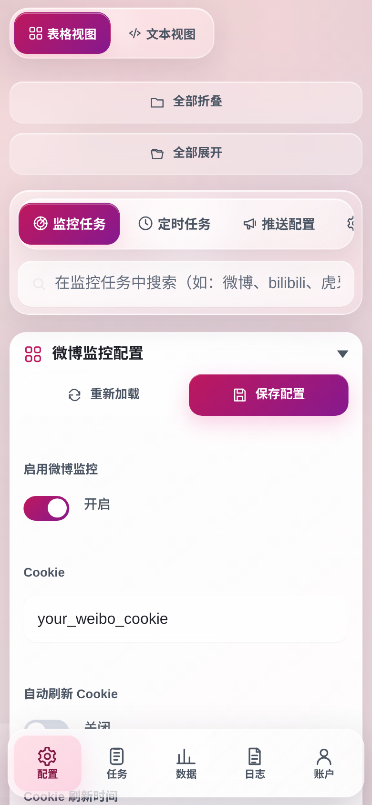
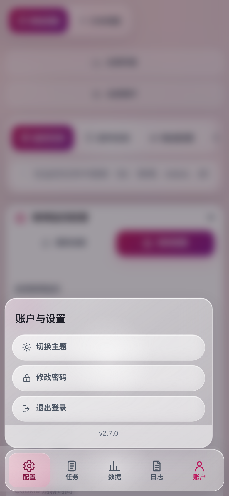
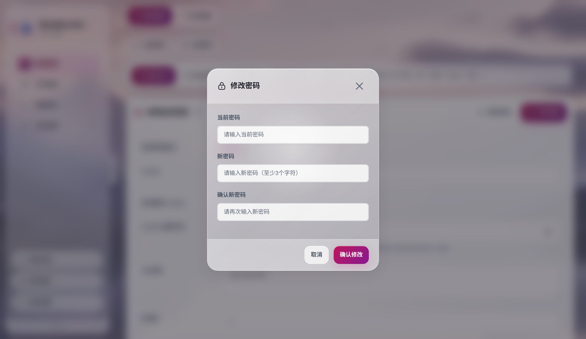
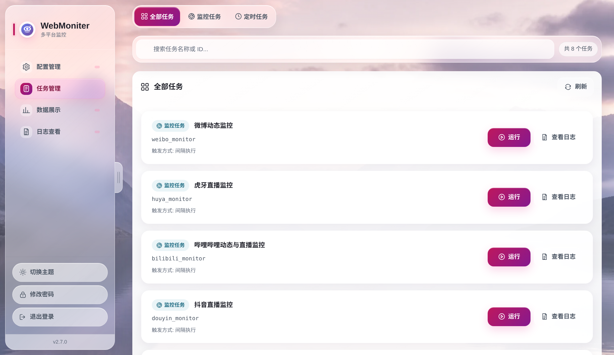
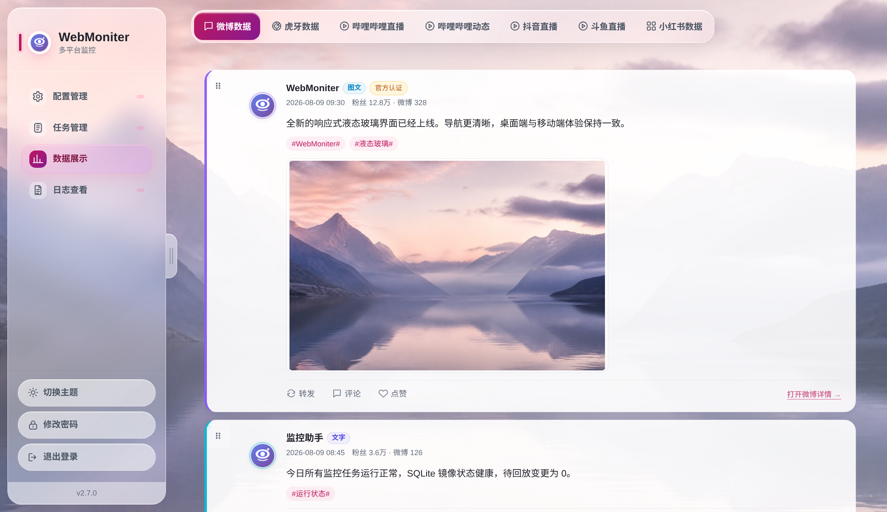
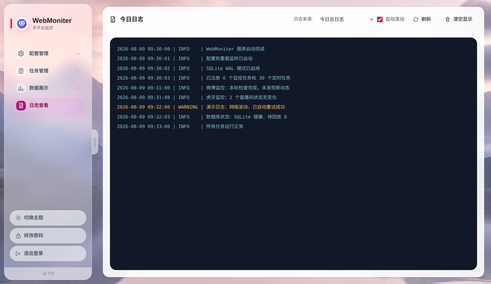

# Web 管理界面

部署完成后访问 `http://localhost:8866`，默认账号 `admin` / `123`。生产环境请在「密码修改」中修改默认凭据。

---

## 功能概览

| 功能 | 说明 |
|:-----|:-----|
| **配置管理** | 可视化编辑 `config.yml`，支持表格视图与文本视图，保存后自动热重载 |
| **密码修改** | 修改 Web 登录密码，生产环境务必修改默认账号 |
| **任务管理** | 查看所有监控任务与定时任务，支持手动触发执行 |
| **数据展示** | 查看微博、虎牙、哔哩哔哩、抖音、斗鱼、小红书等平台的监控数据 |
| **日志查看** | 实时查看当天总日志或各任务专属日志 |

桌面端已去掉整条顶栏；侧边栏右缘有**收起/展开拉手**，点击即可隐藏或唤出导航。手机端用底部导航切换页面，最右侧「账户」打开主题、密码和退出等设置。

## 界面与交互设计

- **材质层级**：侧边栏、底部导航、工具栏、弹窗和交互控件采用液态玻璃材质；数据卡片、表格与长文本等内容层保持较高不透明度，避免背景干扰阅读。
- **指针反馈**：精确指针设备上的可点击控件会轻微上浮/缩放，高光限制在控件内部；触屏设备不依赖悬停完成任何操作。微博数据卡只上浮并显示光泽，不缩放，以保持圆角稳定。
- **响应式布局**：桌面端使用可收起侧边栏，移动端使用包含安全区间距的底部导航；窄屏弹窗以底部面板显示。按钮、输入框和导航入口的主要触控目标不小于 44px。
- **键盘操作**：标签页支持方向键、`Home`、`End` 切换；所有交互元素保留清晰的焦点样式。弹窗打开后焦点进入弹窗，支持 `Esc` 关闭，并在关闭后回到触发控件。
- **系统偏好**：明暗主题可在账户菜单切换并保存在浏览器中；系统启用减少动效、减少透明度、高对比度或强制颜色时，界面会降低动画/模糊并增强边界。

设计原则参考 [Apple Human Interface Guidelines：Materials](https://developer.apple.com/design/human-interface-guidelines/materials)，具体表现以当前浏览器与系统支持能力为准。

| 移动端配置页 | 移动端账户面板 |
|:-------------:|:---------------:|
|  |  |

---

## 配置管理

页面标签可在**表格视图**与 **YAML 文本编辑**之间切换；表格视图可按模块（微博、虎牙、推送通道等）快速定位，YAML 视图可直接修改原始配置。修改后点击保存，约 **5 秒内自动生效**，无需重启程序或容器。

{ width="800" }

**操作提示**：首次配置时，建议先配置至少一个推送通道，再配置监控/签到任务，否则无法收到推送通知。

---

## 密码修改

生产环境务必修改默认账号密码。桌面端从侧边栏进入「密码修改」，移动端从底部导航的「账户」进入，输入当前密码和新密码即可。

!!! warning "安全提醒"
    默认账号 `admin` / `123` 仅用于测试，部署到公网或局域网前请务必修改，避免被未授权访问。

登录状态会持久化在 `data/web_sessions.json`，浏览器 Cookie 与服务端会话默认有效期为一年。源码重启或 Docker 容器重启后，只要 `data` 目录仍然持久化，Web 管理界面不会要求重新登录。修改密码成功后会清理其它旧登录态，仅保留当前会话。

---

## 任务管理

列表展示每个任务的**类型**（监控/定时）、**触发方式**、**描述**等。可对单个任务执行「**立即运行**」强制执行，或点击「**查看日志**」弹出该任务今日专属日志。

{ width="800" }

**关于「当天已运行则跳过」**：定时任务默认会检查当天是否已执行，若已执行则跳过。在「任务管理」中**手动触发**可绕过该检查，强制执行一次。

---

## 数据展示

按平台（微博、虎牙、哔哩哔哩、抖音、斗鱼、小红书）查看监控记录。页面顶部用标签切换数据源，下方为卡片式展示并支持**分页**；切换标签会重新加载数据。微博以时间排序，其他平台支持拖拽调整卡片顺序并保存在浏览器本地。微博卡片悬停不放大，避免 Edge 下圆角丢失。

{ width="800" }

---

## 日志查看

查看当天应用日志，便于排查任务执行、推送失败等问题。支持切换「**今日总日志**」或指定任务的今日专属日志。任务管理页每个任务旁有「查看日志」按钮，可快速弹出该任务的今日日志。

{ width="800" }

---

## 版本与更新

- 侧边栏底部显示**当前版本号**
- 若检测到新版本，页面顶部会显示**更新提示横幅**，点击可跳转至 [GitHub Releases](https://github.com/666fy666/WebMoniter/releases)

---

## 相关文档

- 部署与访问：[安装与运行](../installation.md)
- 配置项说明：[配置说明](config.md)
- 接口与集成：[API 参考](../API.md)
