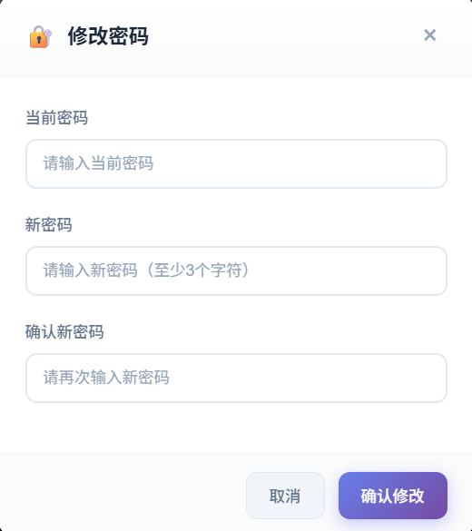

# WebMoniter 文档

**多平台监控签到 · 开播提醒 · 多渠道推送**

Web 任务系统（WebMoniter）支持 **虎牙直播、微博、哔哩哔哩、抖音、斗鱼、小红书** 等平台监控与开播/动态提醒，以及 **iKuuu、百度贴吧、微博超话、雨云、阿里云盘、什么值得买、Freenom、天气推送** 等 30+ 定时签到/任务；使用 **APScheduler** 调度，支持 **15+ 推送通道**（企业微信、钉钉、飞书、Telegram、Bark、邮件等），**配置热重载**，**AI 助手**（RAG + LLM）支持智能问答、配置生成与数据洞察，开箱即用。

---

## 界面预览

> 以下截图来自实际 Web 管理界面，示例账号与数据仅供演示。点击图片可查看大图。

### 配置管理 & 密码修改

左侧 **配置管理** 支持可视化编辑所有监控与签到配置，表格视图与 YAML 文本可切换；右侧 **密码修改** 用于修改 Web 登录密码，生产环境请务必修改默认账号。

| 配置管理 | 密码修改 |
|:--------:|:--------:|
|  |  |
| 可视化编辑 config.yml，支持热重载 | 首次安装请尽快修改默认密码 |

### 任务管理

查看所有监控任务与定时任务，支持「立即运行」手动触发、「查看日志」查看该任务今日日志。

{ width="800" }

### 数据展示

按平台（微博、虎牙、哔哩哔哩等）查看监控记录，支持分页与筛选（按 UID、房间号等）。

{ width="800" }

### 日志查看

实时查看当天总日志或各任务专属日志，支持下拉切换日志来源，便于排查问题。

{ width="800" }

### AI 助手 & 企业微信交互

AI 助手支持在 Web 界面与企业微信中直接对话，可实现配置生成、日志诊断、数据洞察与可执行操作。详见 [AI 助手使用指南](guides/ai-assistant.md)。

| 功能介绍 | 修改配置 | 执行任务 | 查询数据 |
|:--------:|:--------:|:--------:|:--------:|
| { width="200" } | { width="200" } | { width="200" } | { width="200" } |

| 企业微信后台配置 | 企业微信查询数据（示例） |
|:----------------:|:------------------------:|
| { width="300" } | { width="200" } { width="200" } { width="200" } |

---

## 从这里开始

这一节的各个小节会自动出现在右侧侧边栏，便于快速跳转。

### 🚀 快速开始

:material-rocket-launch: 使用 Docker 或 Windows 一键包，几分钟内完成部署并访问 Web 管理界面。若已使用青龙面板，可直接拉取 `ql/` 脚本，通过环境变量配置。

- [安装与运行](installation.md)
- [青龙面板部署](QINGLONG.md)

### ⚙️ 使用指南

:material-cog: 配置监控与签到、了解 Web 管理界面、选择推送通道。

- [配置说明](guides/config.md)
- [Web 管理界面](guides/web-ui.md)
- [AI 助手](guides/ai-assistant.md)
- [监控与定时任务](guides/tasks.md)
- [监控任务详解](guides/tasks/monitors.md)
- [定时任务详解](guides/tasks/checkin.md)
- [推送通道](guides/push-channels.md)

### 🛠 二次开发

:material-hammer-wrench: 了解项目架构、新增监控/定时任务、对接 API。

- [架构概览](ARCHITECTURE.md)
- [二次开发指南](SECONDARY_DEVELOPMENT.md)
- [API 参考](API.md)

### ❓ 常见问题

:material-help-circle: Cookie 更新、任务不执行、监控频率、免打扰等。

- [常见问题 →](faq.md)

---

## 核心特性

| 特性 | 说明 |
|------|------|
| **多平台监控** | 虎牙、微博、哔哩哔哩、抖音、斗鱼、小红书等 6 大平台 |
| **定时签到** | 30+ 平台签到（贴吧、微博超话、iKuuu、雨云、阿里云盘、Freenom 等） |
| **多渠道推送** | 企业微信、钉钉、飞书、Telegram、Bark、WxPusher、邮件等 15+ 通道 |
| **AI 助手** | RAG + LLM 智能问答，配置生成、日志诊断、数据洞察、可执行操作 |
| **配置热重载** | 修改 `config.yml` 约 5 秒内生效，无需重启 |
| **Web 管理** | 配置编辑、任务管理、数据查看、日志查看 |
| **RESTful API** | 便于集成与自动化操作 |

---

## 技术栈

- **运行环境**: Python 3.10+
- **调度**: APScheduler
- **Web**: FastAPI + Uvicorn
- **数据**: SQLite (aiosqlite)
- **配置**: YAML，支持热重载

---

## 链接

- **代码仓库**: [GitHub](https://github.com/666fy666/WebMoniter) · [GitCode](https://gitcode.com/qq_35720175/WebMoniter)
- **Docker**: [fengyu666/webmoniter](https://hub.docker.com/r/fengyu666/webmoniter)
- **Releases**: [GitHub Releases](https://github.com/666fy666/WebMoniter/releases)（含 Windows 一键包）
- **许可证**: [MIT License](https://github.com/666fy666/WebMoniter/blob/main/LICENSE)
