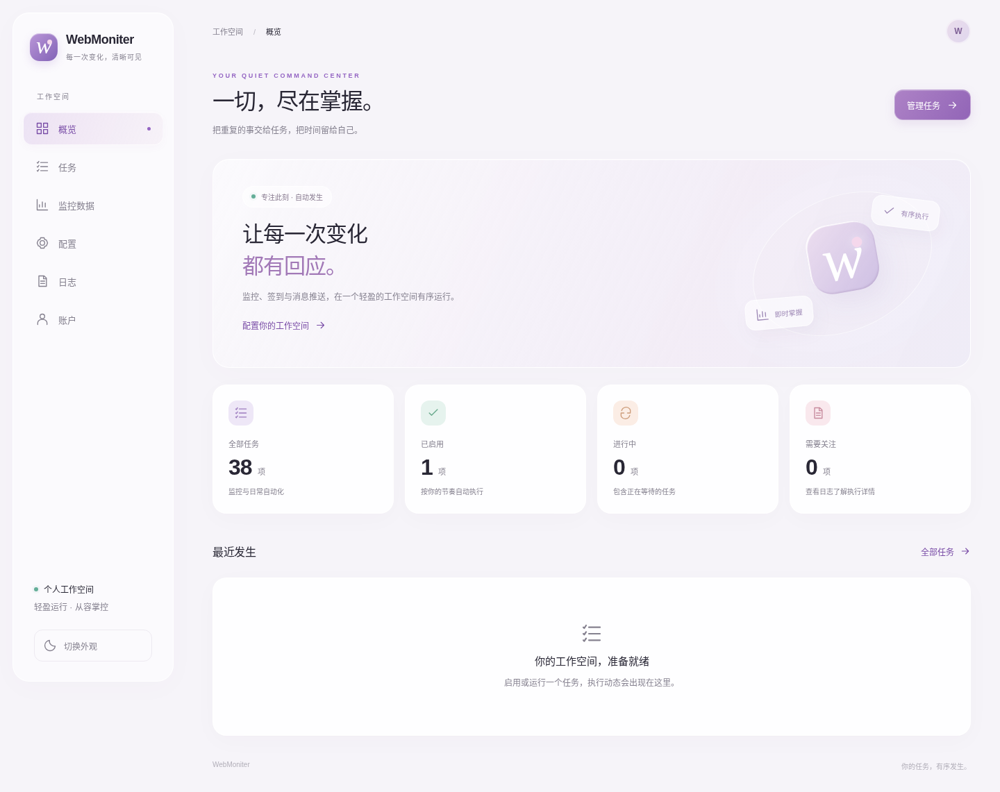
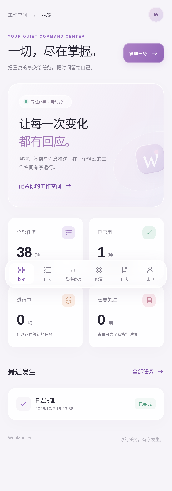

# WebMoniter 文档

**多平台监控签到 · 开播提醒 · 多渠道推送**

Web 任务系统（WebMoniter）支持 **虎牙直播、微博、哔哩哔哩、抖音、快手、斗鱼、小红书** 等平台监控与开播/动态提醒，以及 **微博 Cookie 刷新、iKuuu、百度贴吧、微博超话、雨云、阿里云盘、Freenom、天气推送** 等 **30 个**定时签到/任务；使用 **APScheduler** 调度，支持 **18 种**推送 type（企业微信、钉钉、飞书、Telegram、Bark、邮件等），**配置热重载**，开箱即用。

---

## 界面预览

Vue 界面提供概览、任务、监控数据、配置、日志和账户六个页面。桌面采用侧栏与顶部路径导航；移动端使用底部导航，账户是独立页面。配置按模块保存，数据按平台分页并支持图片预览，日志增量更新。完整操作和自测清单见 [Web 管理界面](guides/web-ui.md)。

| 桌面概览 | 移动端概览 |
|---|---|
|  |  |

截图为 Vue 界面的脱敏演示记录，实际数据与细节以当前代码为准；[配置](assets/screenshots/refactor-config-desktop.png)、[日志](assets/screenshots/refactor-logs-desktop.png)与[账户](assets/screenshots/refactor-account-dark-desktop.png)可查看原图。

---

## 从这里开始

首次安装、日常使用与停用操作可从以下入口查找。

### 🚀 快速开始

:material-rocket-launch: 推荐使用 Docker full 镜像；源码安装与 Windows 包也见安装说明。首次登录 `admin / 123`，修改密码后在配置页启用所需任务。当前服务器部署支持通过 `http://服务器IP:8866` 访问，需按访问来源放行端口；长期访问建议使用 HTTPS。若已使用青龙面板，可通过 `python -m src.ql <task_id>` 运行单次任务，配置来自环境变量。

- [安装与运行](installation.md)
- [Docker 首次部署与访问](DEPLOYMENT.md#first-start)
- [更新已发布版本](DEPLOYMENT.md#update)
- [停止、恢复与彻底卸载](DEPLOYMENT.md#stop-uninstall)
- [备份与恢复](DEPLOYMENT.md#backup-restore)
- [源码更新与清理](installation.md#source-maintenance)
- [青龙面板部署](QINGLONG.md)

### ⚙️ 使用指南

:material-cog: 配置监控与签到、了解 Web 管理界面、选择推送通道。

- [配置说明](guides/config.md)
- [Web 管理界面](guides/web-ui.md)
- [监控与定时任务](guides/tasks.md)
- [监控任务详解](guides/tasks/monitors.md)
- [定时任务详解](guides/tasks/checkin.md)
- [推送通道](guides/push-channels.md)

### 🛠 二次开发

:material-hammer-wrench: 了解项目架构、新增监控/定时任务、对接 API。

- [架构概览](ARCHITECTURE.md)
- [二次开发指南](SECONDARY_DEVELOPMENT.md)
- [API 参考](API.md)

### ❓ 常见问题

:material-help-circle: Cookie 更新、任务不执行、监控频率、免打扰等。

- [常见问题 →](faq.md)

---

## 其他语言

- [English](README.en-US.md)
- [Español](README.es-ES.md)
- [日本語](README.ja-JP.md)
- [한국어](README.ko-KR.md)

---

## 核心特性

| 特性 | 说明 |
|------|------|
| **多平台监控** | 虎牙、微博、哔哩哔哩、抖音、快手、斗鱼、小红书等 6 大平台 |
| **定时签到** | 30 个业务定时任务 + `demo_task` 示例（微博 Cookie 刷新、贴吧、微博超话、iKuuu、雨云、Freenom 等；`TASK_SPECS` 共 31 项） |
| **多渠道推送** | 企业微信、钉钉、飞书、Telegram、Bark、WxPusher、邮件等 18 种 type |
| **配置热重载** | 修改 `config.yml` 约 5 秒内生效，无需重启 |
| **Web 管理** | 响应式液态玻璃界面，支持配置编辑、任务管理、数据查看、日志查看 |
| **RESTful API** | 便于集成与自动化操作 |

---

## 技术栈

- **运行环境**: Python 3.11
- **调度**: APScheduler
- **Web**: FastAPI + Uvicorn
- **数据**: 默认本地 SQLite；可选 MySQL 权威主库与 SQLite 镜像/故障回退
- **配置**: YAML，支持热重载

---

## 链接

- **代码仓库**: [GitHub](https://github.com/666fy666/WebMoniter) · [GitCode](https://gitcode.com/qq_35720175/WebMoniter)
- **Docker**: [fengyu666/webmoniter](https://hub.docker.com/r/fengyu666/webmoniter)（`docker/Dockerfile`→`latest` 精简；雨云用 `docker/Dockerfile --target full` / 标签 `:full`）
- **Releases**: [GitHub Releases](https://github.com/666fy666/WebMoniter/releases)（含 Windows 一键包）
- **许可证**: [MIT License](https://github.com/666fy666/WebMoniter/blob/main/LICENSE)
