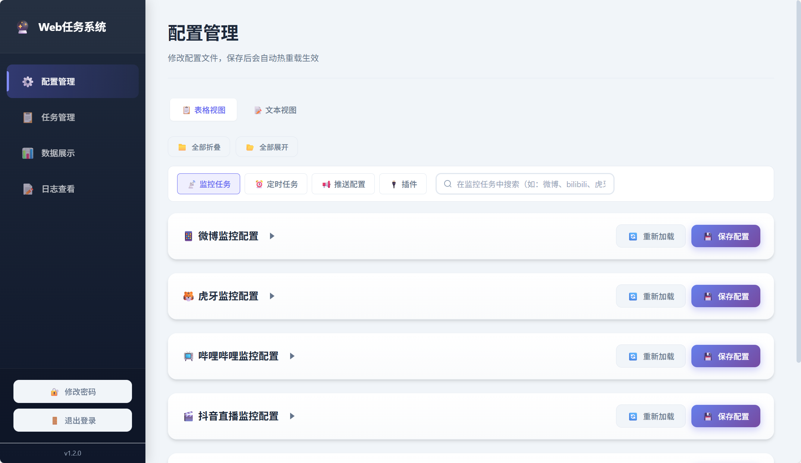
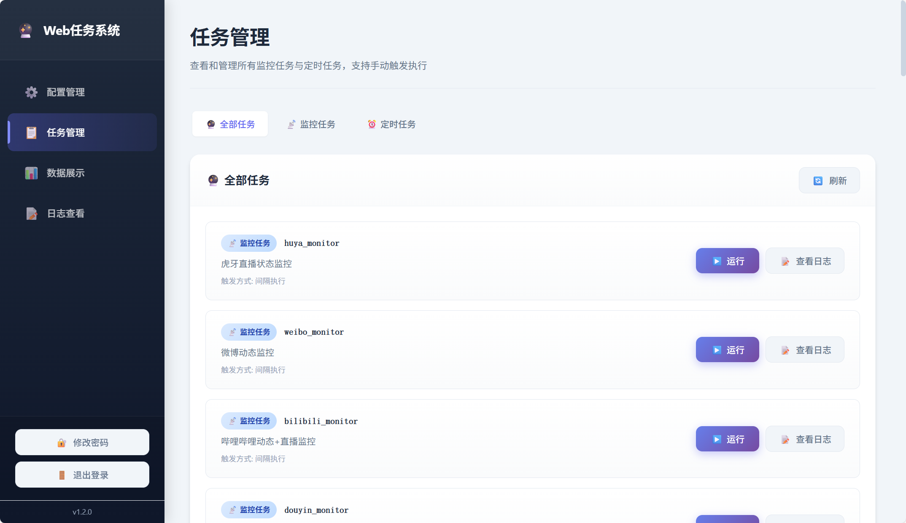

# 安装与运行

支持 **Docker**（推荐）、**Windows 一键包** 和 **本地 Python** 三种方式。部署完成后访问 `http://localhost:8866`，默认账号 `admin` / `123`。

---

## 部署完成后效果

启动成功后，在浏览器访问 `http://localhost:8866`，使用默认账号 `admin` / `123` 登录，即可看到 Web 管理界面：

| 配置管理（登录后默认首页） | 任务管理 |
|:------------------------:|:--------:|
|  |  |
| 左侧导航 + 右侧编辑区，修改后自动热重载 | 侧边栏可切换：配置管理、任务管理、数据展示、日志查看 |

!!! success "下一步"
    登录后建议：① 在「密码修改」中修改默认密码；② 在「配置管理」中配置至少一个推送通道和要使用的任务。

---

## Docker 部署（推荐）

**要求**: Docker >= 20.10、Docker Compose >= 2.0，支持 amd64 / arm64。

```bash
# 1. 克隆项目
git clone https://github.com/666fy666/WebMoniter.git
cd WebMoniter

# 2. 复制并编辑配置文件
cp config.yml.sample config.yml
# 编辑 config.yml，配置监控任务和推送通道

# 3. 启动服务
docker compose up -d
```

!!! tip "提示"
    - `config.yml` 支持热重载（约 5 秒生效），无需重启
    - 数据持久化：`config.yml`、`data/`、`logs/` 已挂载，`docker compose down` 不会丢失

---

## Windows 部署

**无需安装 Python 环境**，下载即用。

1. 前往 [GitHub Releases](https://github.com/666fy666/WebMoniter/releases/latest) 下载最新的 `WebMoniter-vX.X.X-windows-x64.zip`
2. 解压到任意目录
3. 将 `config.yml.sample` 复制为 `config.yml`，并按需编辑配置
4. 双击 `WebMoniter.exe` 启动（会弹出控制台窗口显示日志）

!!! tip "提示"
    - 首次运行 Windows 防火墙可能提示网络访问权限，请允许
    - 关闭控制台窗口即可停止程序
    - `config.yml` 支持热重载，修改配置无需重启

---

## 青龙面板部署

**适用**：已安装 [青龙面板](https://github.com/whyour/qinglong) 的用户。通过**环境变量**配置参数，推送自动走**青龙内置通知**（QLAPI），与主项目逻辑完全兼容。

**快速步骤**：

1. **添加环境变量**（青龙 → 环境变量）：如 `WEBMONITER_CHECKIN_ENABLE=true`、`WEBMONITER_CHECKIN_EMAIL`、`WEBMONITER_CHECKIN_PASSWORD`
2. **拉取脚本**：订阅 `https://github.com/666fy666/WebMoniter`，白名单 `ql/*.py`；或使用 `ql raw` 拉取单个脚本
3. **添加定时任务**：命令 `task WebMoniter/ql/ikuuu_checkin.py`，定时规则 `0 8 * * *`（示例）

!!! success "推送通知"
    青龙环境下自动使用**青龙系统通知**，在青龙「系统设置 → 通知设置」中配置推送方式即可，无需额外配置。

**完整操作指南**（环境变量一览、多账号配置、常见问题）：[青龙面板兼容指南](QINGLONG.md)

---

## 本地安装

**要求**: Python >= 3.10、[uv](https://docs.astral.sh/uv/getting-started/installation/)

```bash
# 1. 克隆项目
git clone https://github.com/666fy666/WebMoniter.git
cd WebMoniter

# 2. 安装依赖
uv sync --locked

# 3. 复制配置文件
cp config.yml.sample config.yml

# 4. 启动程序
uv run python main.py

# 后台启动（推荐用于长期运行）
uv run python main.py &

# 可选：将日志输出重定向到文件
# uv run python main.py > webmoniter.log 2>&1 &

# 可选：启用 AI 助手（配置生成、日志诊断、数据洞察等）
# uv sync
```

---

## 更新

| 部署方式 | 更新方式 |
|:--------:|:--------|
| Docker   | `docker compose pull && docker compose up -d` |
| Windows  | 下载最新 Release 的 ZIP，解压覆盖（保留 `config.yml`） |
| 本地     | `git pull` → `uv sync --locked` → 重启应用 |

!!! tip "提示"
    配置支持热重载，多数更新无需重启。更新前建议备份 `config.yml`、`data/`。

**版本更新提醒**：登录 Web 管理界面后，侧边栏底部显示当前版本号；若检测到新版本，页面顶部会显示更新提示横幅，可跳转至 [GitHub Releases](https://github.com/666fy666/WebMoniter/releases) 查看。
