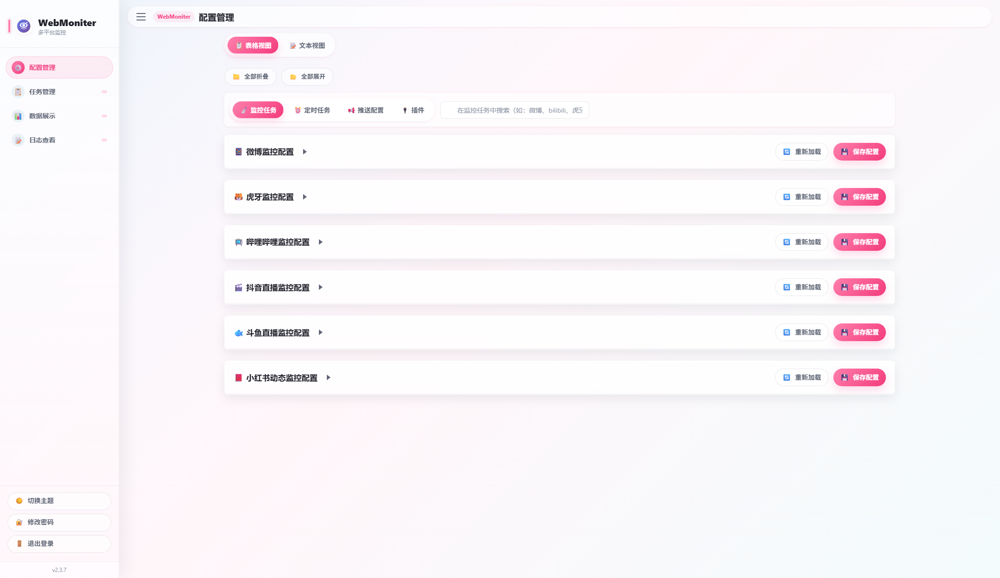

# 安装与运行

支持 **Docker**（推荐）、**Windows 一键包** 和 **本地 Python** 三种方式。部署完成后访问 `http://localhost:8866`，默认账号 `admin` / `123`。

---

## 部署完成后效果

启动成功后，在浏览器访问 `http://localhost:8866`，使用默认账号 `admin` / `123` 登录，即可看到 Web 管理界面：

| 配置管理（登录后默认首页） | 任务管理 |
|:------------------------:|:--------:|
|  |  |
| 左侧导航 + 右侧编辑区，修改后自动热重载 | 侧边栏可切换：配置管理、任务管理、数据展示、日志查看 |

!!! success "下一步"
    登录后建议：① 在「密码修改」中修改默认密码；② 在「配置管理」中配置至少一个推送通道和要使用的任务。

---

## Docker 部署（推荐）

**要求**: Docker >= 20.10、Docker Compose >= 2.0，支持 amd64 / arm64。

### 镜像选择

| 镜像 | 标签 | Compose 文件 | 适用场景 |
|:--|:--|:--|:--|
| 精简镜像 | `fengyu666/webmoniter:latest` | `docker/docker-compose.yml` | 默认推荐。适合监控、推送和大多数 HTTP 类签到 |
| 完整镜像 | `fengyu666/webmoniter:full` | `docker/docker-compose.full.yml` | 需要在容器内运行雨云浏览器签到时使用 |

`latest` 与 semver 主标签（如 `2.2.2`）由 `docker/Dockerfile` 构建，不包含 Chromium/Chromedriver，也不安装 Selenium、ddddocr、OpenCV 等雨云浏览器签到依赖。`full` 由 `docker/Dockerfile.full` 构建，体积更大，但包含浏览器运行环境。

!!! warning "二选一运行"
    两个 Compose 文件的默认容器名都是 `webmoniter`，请根据需要选择精简镜像或完整镜像，不要同时启动两套 Compose。

### 方式一：Docker Compose

```bash
# 1. 克隆项目
git clone https://github.com/666fy666/WebMoniter.git
cd WebMoniter

# 2. 复制并编辑配置文件（模板在 config/ 目录）
cp config/config.yml.sample config.yml
# 编辑 config.yml，配置监控任务和推送通道

# 3. 启动精简镜像（Compose 文件在 docker/，请在仓库根目录执行）
docker compose -f docker/docker-compose.yml pull
docker compose -f docker/docker-compose.yml up -d
```

精简镜像常用命令：

```bash
# 查看状态和日志
docker compose -f docker/docker-compose.yml ps
docker compose -f docker/docker-compose.yml logs -f

# 停止容器，保留容器和数据
docker compose -f docker/docker-compose.yml stop

# 再次启动已经停止的容器
docker compose -f docker/docker-compose.yml start

# 重启容器
docker compose -f docker/docker-compose.yml restart

# 停止并删除容器/网络，保留仓库根目录下的 config.yml、data/、logs/
docker compose -f docker/docker-compose.yml down

# 更新镜像并重新创建容器
docker compose -f docker/docker-compose.yml pull
docker compose -f docker/docker-compose.yml up -d

# 删除本地精简镜像（需要先 down 或 rm 掉使用它的容器）
docker image rm fengyu666/webmoniter:latest
```

如果启用雨云浏览器签到（`rainyun.enable: true`），使用完整镜像：

```bash
# 启动完整镜像
docker compose -f docker/docker-compose.full.yml pull
docker compose -f docker/docker-compose.full.yml up -d

# 查看状态和日志
docker compose -f docker/docker-compose.full.yml ps
docker compose -f docker/docker-compose.full.yml logs -f

# 停止 / 再次启动 / 重启
docker compose -f docker/docker-compose.full.yml stop
docker compose -f docker/docker-compose.full.yml start
docker compose -f docker/docker-compose.full.yml restart

# 删除容器/网络，保留仓库根目录下的 config.yml、data/、logs/
docker compose -f docker/docker-compose.full.yml down

# 删除本地完整镜像（需要先 down 或 rm 掉使用它的容器）
docker image rm fengyu666/webmoniter:full
```

!!! tip "提示"
    - `config.yml` 支持热重载（约 5 秒生效），无需重启
    - 数据持久化：`config.yml`、`data/`、`logs/` 挂载到仓库根目录对应路径，`docker compose ... down` 不会丢失容器外数据
    - 容器启动时会通过 **docker/docker-entrypoint.sh**（镜像内 `/app/docker-entrypoint.sh`）自动为 `data/`、`logs/` 及其子目录赋予读写权限，避免 bind mount 导致 SQLite 数据库或日志文件只读无法写入
    - 默认端口 8866，如需修改可在 `environment` 中增加 `PORT=8080` 等，并在 `ports` 中映射对应端口

### 方式二：docker run 单容器

不使用 Compose 时，可以直接运行单个容器。请先准备配置文件和持久化目录：

```bash
cp config/config.yml.sample config.yml
mkdir -p data logs
```

精简镜像：

```bash
# 拉取并启动
docker pull fengyu666/webmoniter:latest
docker run -d --name webmoniter --restart unless-stopped \
  -p 8866:8866 --shm-size=128m \
  -e TZ=Asia/Shanghai \
  -v "$(pwd)/config.yml:/app/config.yml" \
  -v "$(pwd)/data:/app/data" \
  -v "$(pwd)/logs:/app/logs" \
  fengyu666/webmoniter:latest

# 查看日志 / 停止 / 再次启动 / 重启
docker logs -f webmoniter
docker stop webmoniter
docker start webmoniter
docker restart webmoniter

# 删除容器；如果容器仍在运行，可使用 docker rm -f webmoniter
docker rm webmoniter

# 删除镜像
docker image rm fengyu666/webmoniter:latest
```

完整镜像：

```bash
# 拉取并启动
docker pull fengyu666/webmoniter:full
docker run -d --name webmoniter-full --restart unless-stopped \
  -p 8866:8866 --shm-size=256m \
  -e TZ=Asia/Shanghai \
  -e CHROME_BIN=/usr/bin/chromium \
  -e CHROMEDRIVER_PATH=/usr/bin/chromedriver \
  -v "$(pwd)/config.yml:/app/config.yml" \
  -v "$(pwd)/data:/app/data" \
  -v "$(pwd)/logs:/app/logs" \
  fengyu666/webmoniter:full

# 查看日志 / 停止 / 再次启动 / 重启
docker logs -f webmoniter-full
docker stop webmoniter-full
docker start webmoniter-full
docker restart webmoniter-full

# 删除容器；如果容器仍在运行，可使用 docker rm -f webmoniter-full
docker rm webmoniter-full

# 删除镜像
docker image rm fengyu666/webmoniter:full
```

!!! tip "Windows PowerShell"
    如果 `-v "$(pwd)/config.yml:/app/config.yml"` 在 PowerShell 中解析异常，可把 `$(pwd)` 换成当前目录的绝对路径，例如 `D:/code/WebMoniter/config.yml:/app/config.yml`。

!!! danger "删除数据"
    `docker compose ... down`、`docker rm` 只删除容器和网络，不会删除仓库根目录下的 `config.yml`、`data/`、`logs/`。如果要彻底清空历史数据，请在确认备份后手动删除这些文件和目录。

---

## Windows 部署

**无需安装 Python 环境**，下载即用。

1. 前往 [GitHub Releases](https://github.com/666fy666/WebMoniter/releases/latest) 下载最新的 `WebMoniter-vX.X.X-windows-x64.zip`
2. 解压到任意目录
3. 将解压目录下的 `config.yml.sample` 复制为 `config.yml`，并按需编辑配置（与源码中 `config/config.yml.sample` 一致）
4. 双击 `WebMoniter.exe` 启动（会弹出控制台窗口显示日志）

!!! tip "提示"
    - 首次运行 Windows 防火墙可能提示网络访问权限，请允许
    - 关闭控制台窗口即可停止程序
    - `config.yml` 支持热重载，修改配置无需重启

---

## 青龙面板部署

**适用**：已安装 [青龙面板](https://github.com/whyour/qinglong) 的用户。通过**环境变量**配置参数，推送自动走**青龙内置通知**（QLAPI），与主项目逻辑完全兼容。

**快速步骤**：

1. **添加环境变量**（青龙 → 环境变量）：如 `WEBMONITER_CHECKIN_ENABLE=true`、`WEBMONITER_CHECKIN_EMAIL`、`WEBMONITER_CHECKIN_PASSWORD`
2. **订阅项目**：订阅 `https://github.com/666fy666/WebMoniter`，需保留完整项目代码；如果使用青龙白名单，请至少包含 `src/`、`pyproject.toml`、`uv.lock`
3. **添加定时任务**：命令 `cd /path/to/WebMoniter && python -m src.ql ikuuu_checkin`，定时规则 `0 8 * * *`（示例）

!!! success "推送通知"
    青龙环境下自动使用**青龙系统通知**，在青龙「系统设置 → 通知设置」中配置推送方式即可，无需额外配置。

**完整操作指南**（环境变量一览、多账号配置、常见问题）：[青龙面板兼容指南](QINGLONG.md)

---

## 本地安装

**要求**: Python >= 3.10、[uv](https://docs.astral.sh/uv/getting-started/installation/)

```bash
# 1. 克隆项目
git clone https://github.com/666fy666/WebMoniter.git
cd WebMoniter

# 2. 固定源码运行 Python 版本并安装依赖
uv python install 3.11
uv venv --python 3.11
uv sync --locked --extra dev --extra rainyun

# 3. 复制配置文件
cp config/config.yml.sample config.yml

# 4. 启动程序（默认端口 8866，可通过环境变量 PORT 覆盖，如 PORT=8080 uv run python main.py）
uv run python main.py

# 后台启动（推荐用于长期运行）
uv run python main.py &

# 可选：将日志输出重定向到文件
# uv run python main.py > webmoniter.log 2>&1 &

```

源码启动会先执行环境预检：uv、Python 3.11、虚拟环境、pytest/dev 依赖，以及启用 iKuuu/雨云时的 Chrome/本地 chromedriver 状态。若不满足，终端会直接给出修复命令。默认不会启动 WebDriver 或触发 Selenium Manager 下载；如需启动前实际烟测，可设置 `WEBMONITER_PREFLIGHT_BROWSER_SMOKE=1`。

!!! tip "停止程序"
    在终端按 `Ctrl+C` 会触发优雅关闭：停止调度器、关闭 Web 服务、配置监控器和数据库连接。项目会为同步网络请求、浏览器任务等阻塞场景设置兜底，通常会在数秒内退出；如果仍在等待，再按一次 `Ctrl+C` 会立即强制退出。

---

## 更新

| 部署方式 | 更新方式 |
|:--------:|:--------|
| Docker 精简镜像 | `docker compose -f docker/docker-compose.yml pull && docker compose -f docker/docker-compose.yml up -d` |
| Docker 完整镜像 | `docker compose -f docker/docker-compose.full.yml pull && docker compose -f docker/docker-compose.full.yml up -d` |
| Windows | 下载最新 Release 的 ZIP，解压覆盖（保留 `config.yml`） |
| 本地 | `git pull` → `uv sync --locked` → 重启应用 |

!!! tip "提示"
    配置支持热重载，多数更新无需重启。更新前建议备份 `config.yml`、`data/`。

**版本更新提醒**：登录 Web 管理界面后，侧边栏底部显示当前版本号；若检测到新版本，页面顶部会显示更新提示横幅，可跳转至 [GitHub Releases](https://github.com/666fy666/WebMoniter/releases) 查看。
